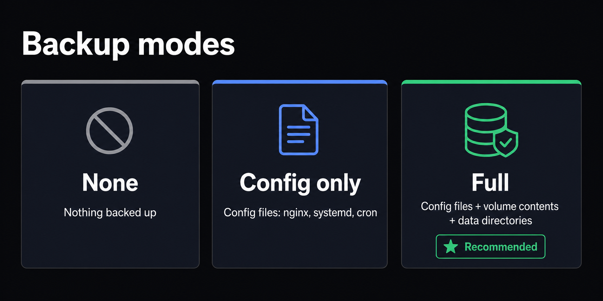

DEL takes two kinds of backup: the **removal-job backups** it creates automatically
before it deletes anything, and the **database snapshots** you take of DEL's own
bookkeeping. This page covers both, and how to restore from them.

## Backup modes on a removal plan

<Frame caption="The three backup modes and what each one captures. Full is recommended for any removal touching data.">
  
</Frame>

When you build a removal plan you choose a **Backup mode**:

| Mode | What it captures | When to use |
|---|---|---|
| **None** | Nothing. | Almost never — only for throwaway resources you are certain about. |
| **Config only** | Config files (nginx sites, systemd units, cron entries) before they're edited/removed. | Removals that touch no data (no volumes, no data directories). |
| **Full (config + volumes)** | Config files **plus** tarred volume contents and bind-mount directories. | Any removal that deletes a named volume or a data directory. **Recommended.** |

<Callout intent="warning">
  If a plan deletes a volume or a bind-mounted data directory, choose **Full**.
  Volume deletion is irreversible unless its contents were captured in a backup first.
</Callout>

## Where backups land

Everything lives under **`/apps/del/backups/`**:

- **Per-job backups** are taken during the *backup* stage of every removal, before any
  mutation. They are content-addressed (`sha256`, `size`) and tracked in the
  `backups` table, linked to the `job_id`. You'll see the corresponding steps —
  `file_backup`, `volume_backup`, `backup_tar` — at the top of every job.
- **Database snapshots** from `del-admin backup-db` are written as
  `/apps/del/backups/del-<UTC-timestamp>.db`.

## Backing up the database

```bash
/apps/del/scripts/del-admin backup-db
```

Writes a consistent SQLite snapshot (via `sqlite3.Connection.backup`) to
`/apps/del/backups/`. `del.db` is a single file, so it also folds into the host's
normal backup routine with no special handling. Take one before any manual database
surgery.

## Restoring after a removal

<Callout intent="info">
  Restoring DEL's **database** never undoes a real removal — those changes were made
  to actual host resources, not database rows. To reverse an executed removal, use the
  **job's backups** described here.
</Callout>

To reverse a removal job manually, use the backups it took (all under
`/apps/del/backups/`, keyed by `job_id`):

- **nginx site** — copy the timestamped `.bak.<ts>` config back over the removed site
  file, `sudo nginx -t`, then `sudo systemctl reload nginx`. (The engine does this
  automatically if the failure happens *during* the job; this is for reversing an
  already-finished one.)
- **systemd unit** — copy the backed-up unit file back to `/etc/systemd/system/`,
  `sudo systemctl daemon-reload`, then `sudo systemctl enable --now <unit>`.
- **volume / container data** — restore from the `volume_backup` / `backup_tar`
  archive into a recreated volume, then bring the app's Compose project back up.
- **files / directories** — extract the `backup_tar` archive back to its original
  path.

For restoring DEL's own database from a snapshot (as opposed to reversing a removal),
and for the full recovery runbook, see [Recovery](/guides/recovery).
