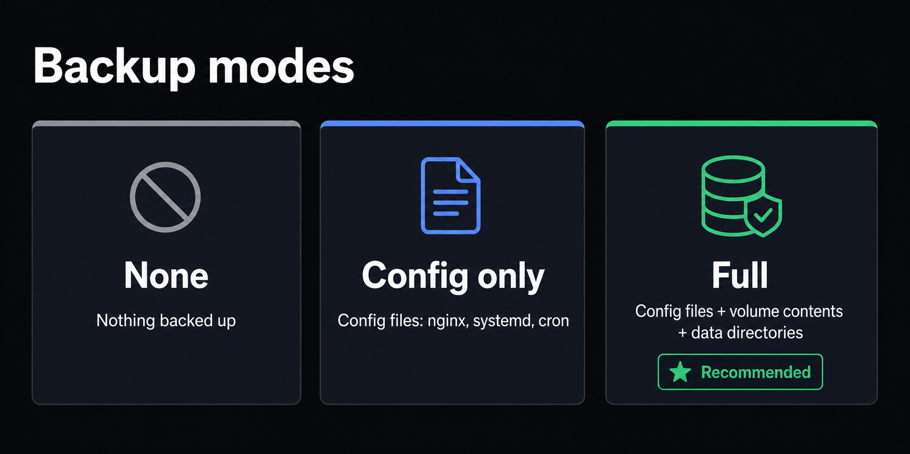

DEL takes two kinds of backup: the **removal-job backups** it creates automatically
before it deletes anything, and the **database snapshots** you take of DEL's own
bookkeeping. This page covers both, and how to restore from them.

## Backup modes on a removal plan

<Frame caption="The three backup modes and what each one captures. Full is recommended for any removal touching data.">
  
</Frame>

When you build a removal plan you choose a **Backup mode**:

| Mode | What it captures | When to use |
|---|---|---|
| **None** (default) | Nothing — no backup steps are added to the plan at all, and the automatic in-job rollback described below will have nothing to restore from. | Throwaway apps you are certain about; also the default for the "Complete removal" preset. Switch away from this when you may need a restore. |
| **Config only** | Config files (nginx sites, systemd units, cron entries) before they're edited/removed. | Removals that touch no data (no volumes, no data directories). |
| **Full (config + volumes)** | Config files **plus** tarred volume contents and bind-mount directories. | Any removal that deletes a named volume or a data directory when you want recoverability. |

<Callout intent="warning">
  If a plan deletes a volume or a bind-mounted data directory, choose **Full**.
  Volume deletion is irreversible unless its contents were captured in a backup first.
</Callout>

## Where backups land

Everything lives under **`/apps/del/backups/`**:

- **Per-job backups** are taken during the `backup` stage, before any mutation —
  when the plan asked for them. You'll see the corresponding steps (`file_backup`,
  `volume_backup`, `backup_tar`) at the top of the job. On a **live** job each
  completed backup step also writes a row to the `backups` table (`job_id`, `kind`,
  `src`, `dest`), and that row is what the automatic in-job rollback reads.
- **Database snapshots** from `del-admin backup-db` are written as
  `/apps/del/backups/del-<timestamp>.db`. The timestamp is **host local time**, not
  UTC.

<Callout intent="warning">
  Backups are plain `cp -a` / `tar` copies. The `backups` table has `sha256` and
  `size` columns, but nothing populates them — they are **not** content-addressed
  or integrity-checked. Verify an archive yourself if that matters to you.
</Callout>

## Backing up the database

```bash
/apps/del/scripts/del-admin backup-db
```

Writes a consistent SQLite snapshot (via `sqlite3.Connection.backup`) to
`/apps/del/backups/del-<timestamp>.db`, where the timestamp comes from
`datetime.now()` — **host local time**, so Eastern on this host, not UTC. `del.db`
is a single file, so it also folds into the host's normal backup routine with no
special handling. Take one before any manual database surgery.

## Restoring after a removal

<Callout intent="info">
  Restoring DEL's **database** never undoes a real removal — those changes were made
  to actual host resources, not database rows. To reverse an executed removal, use the
  **job's backups** described here.
</Callout>

### What rolls back automatically, and what does not

Two different mechanisms, worth keeping straight:

- **Inside `nginx_rm_site`** — the helper copies each site file to
  `/apps/del/backups/` first, removes them, runs `nginx -t`, and copies them
  straight back if the test fails. Self-contained, database-independent, and the one
  rollback path that has always worked.
- **Job-level restore** — when an `nginx_rm_site`, `nginx_test_reload`,
  `systemd_disable` or `systemd_rm_unit` step fails, the engine walks this job's
  `backups` rows newest-first, calls the helper's `path_restore` for each, and
  audits the real per-backup outcome. Volume archives are deliberately skipped and
  reported as manual-restore — a `volume_backup` is a tar of a volume's *contents*,
  not a filesystem path. This path only has something to restore if the plan's
  backup mode was Config or Full and the job ran live.

<Callout intent="warning">
  **If you are looking at a job from before 2026-08-24:** nothing ever wrote the
  `backups` table, so the job-level restore iterated an empty set while still
  recording `job_restore_attempted` in the audit log. Those jobs were not rolled
  back, whatever the audit says. The `nginx_rm_site` internal restore was unaffected.
</Callout>

To reverse a removal job manually, use the backups it took (all under
`/apps/del/backups/`, keyed by `job_id`):

- **nginx site** — copy the timestamped `.bak.<ts>` config back over the removed site
  file, `sudo nginx -t`, then `sudo systemctl reload nginx`. (This is for reversing
  an already-finished job; a failure *during* the job is handled above.)
- **systemd unit** — copy the backed-up unit file back to `/etc/systemd/system/`,
  `sudo systemctl daemon-reload`, then `sudo systemctl enable --now <unit>`.
- **volume / container data** — restore from the `volume_backup` / `backup_tar`
  archive into a recreated volume, then bring the app's Compose project back up.
- **files / directories** — extract the `backup_tar` archive back to its original
  path.

For restoring DEL's own database from a snapshot (as opposed to reversing a removal),
and for the full recovery runbook, see [Recovery](/guides/recovery).

## Backup destinations are unique per source file

A backup lands at
`{backups_dir}/{slug}/{resource_type}/{flattened-parent-dir}/{filename}`.
Keying only on the filename would make two config files with the same name
(`server/compose.yaml` and `server/config/compose.yaml`) share one destination —
the second would overwrite the first, and a rollback would then restore that one
file over both originals. The filename itself is preserved because a restore is
required to keep the backup's basename.
