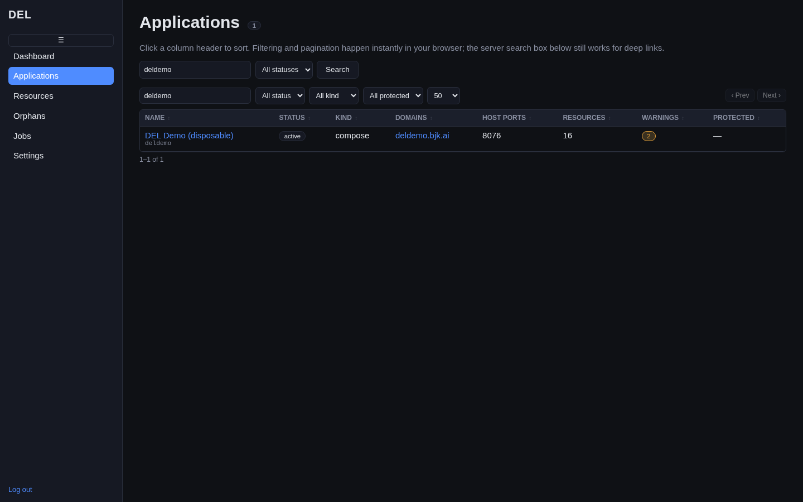
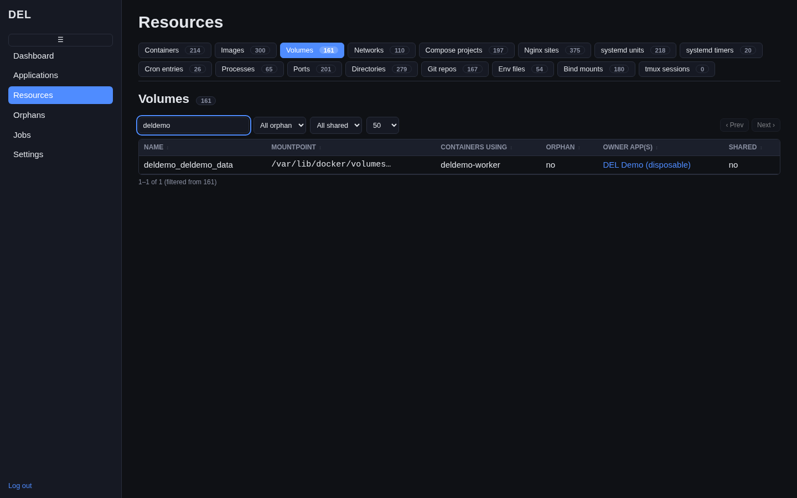
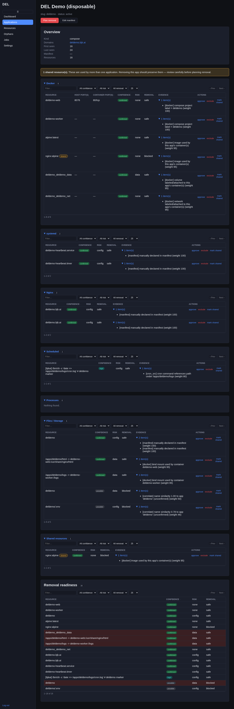
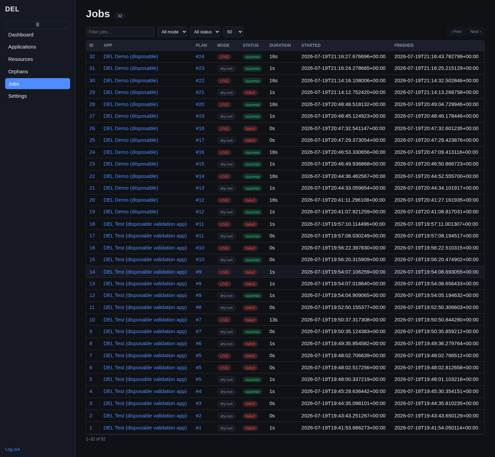

Once a scan has run, everything DEL found is browsable from the sidebar. This page
covers the two main views — **Applications** and **Resources** — and the table
controls and badges you'll see throughout. The sidebar also has a **Docs** link
(opens this documentation site in a new tab; it's basic-auth protected separately
from your DEL login).

## The Applications list

**Applications** lists every application DEL correlated, one row each. The count
pill next to the heading shows the total. Click any application name to open its
[detail page](#the-application-detail-page).

<Frame caption="The Applications list, filtered to a single app. Each row shows status, kind, domains, ports, resource count, warnings, and whether the app is protected.">
  
</Frame>

Columns: **Name** (with the slug beneath), **Status**, **Kind**, **Domains** (each a
clickable link to the site), **Host ports**, **Resources** (count), **Warnings** (an
amber badge when non-zero), and **Protected** (a blue badge for apps DEL will refuse
to remove, such as DEL itself).

<Callout intent="info">
  By default, **Applications** only shows apps present in the **latest scan** — once
  an app is fully removed, it disappears from this list on its own (a successful live
  removal triggers an automatic rescan, so you don't have to remember to refresh it
  yourself). Add `?show=removed` to the URL to see removed apps too; visiting a
  removed app's detail page directly shows a "not present in the latest scan" banner
  instead of a 404, so its history stays reachable.
</Callout>

## Table controls

Every table in DEL behaves the same way, all client-side (no page reloads):

- **Sort** — click a column header to sort by it; click again to reverse.
- **Filter** — a single *Filter…* box narrows rows as you type, instantly, client-side.
  Some columns also expose a dropdown filter (for example, filtering applications by
  status, kind, or protected).
- **Deep links** — visiting `/apps?search=…` prefills the filter box with that term,
  so you can share or bookmark a filtered view; there is no separate server-side
  search form to keep in sync.
- **Pagination** — long tables paginate with a page-size selector and **‹ Prev** /
  **Next ›** controls.

## The Resources view

**Resources** shows every discovered resource, split into a **tab bar** by type.
Each tab's count pill tells you how many of that type exist.

<Frame caption="The Resources view on the Volumes tab. Note the tab bar with per-type counts, the orphan badges, and the owner column.">
  
</Frame>

The columns are tailored per type — for example volumes show mountpoint, containers
using them, and an **orphan** badge when nothing is using them; nginx sites show
server names, config path, upstream ports, and an **ssl** badge. Two columns are
common to almost every type:

- **Owner app(s)** — which application(s) DEL attributes the resource to, each a link
  to that app. Resources DEL couldn't attribute show an `unassigned` badge (these are
  the [orphans](/guides/orphans)).
- **Shared** — an amber **shared** badge marks a resource associated with **more than
  one** application. Shared resources are protected: removing one app's plan will
  never silently delete something another app still depends on.

## The Application detail page

An application's detail page is where you review everything DEL believes it owns
before planning a removal. Resources are grouped into collapsible sections —
**Docker**, **systemd**, **Nginx**, **Scheduled**, **Processes**, **Files /
Storage**, and **Shared resources**.

<Frame caption="An application detail page with every section and its evidence expanded.">
  
</Frame>

For each associated resource you see:

- a **Confidence** badge (`confirmed`, `high`, `probable`, `possible`) — explained in
  [Understanding Confidence](/guides/confidence);
- a **Risk** column (`data`, `config`, or `safe`), flagging data-loss potential;
- a **Removal** column (`safe` / `blocked`) showing whether it is eligible;
- an expandable **Evidence** list — the specific facts (with weights) behind the
  association, e.g. *"[docker] compose project label = deldemo (weight 100)"*;
- an **Actions** cell with **approve**, **exclude**, and **mark shared** — see
  [approving resources](#approving-and-excluding-resources).

At the top of the page, **Plan removal** starts a
[removal plan](/guides/removing-an-application) (disabled and greyed out for
protected apps), and **Edit manifest** lets you correct DEL's correlation by hand.

### Approving and excluding resources

The **Actions** on each resource row let you override DEL's automatic correlation:

- **approve** — confirm a `probable` association so it becomes eligible for a plan.
- **exclude** — drop a resource from this app's associations regardless of what
  correlation found.
- **mark shared** — flag a resource as shared so it is preserved rather than removed.

These are the controls you use before planning if DEL was unsure about something.

## The Jobs list

**Jobs** lists every removal job DEL has run — both dry-runs and live runs — newest
first. Each row links to the app, the plan it executed, and the job detail, and shows
a **Mode** badge (grey `dry-run` or red `LIVE`) and a **Status** badge. It's the
audit trail of everything DEL has changed on the host.

<Frame caption="The Jobs list: every dry-run and live removal, with mode and status badges.">
  
</Frame>

Next: [Understanding Confidence](/guides/confidence).
