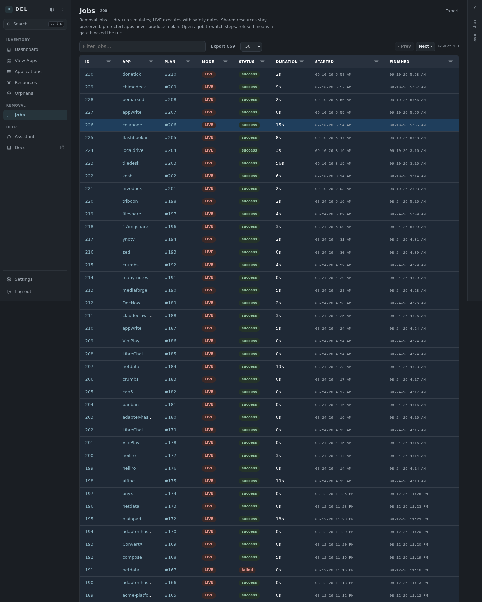

Once a scan has run, everything DEL found is browsable from the sidebar. This page
opens with the **View Apps** launchpad and covers the two inventory views —
**Applications** and **Resources** — plus the table
controls and badges you'll see throughout. The sidebar also has a **Docs** link
(opens this documentation site in a new tab; docs are open — no separate basic
auth. The app UI still requires your DEL login).

## The View Apps launchpad

**View Apps** is the clean, homelab-style gallery for opening web applications.
It is intentionally stricter than the inventory table: a card appears only when
the application and its enabled Nginx domain are present in the latest completed
scan **and** a live HTTPS check succeeds. DEL verifies DNS, TLS, the Nginx route,
and that an upstream answers. HTTP responses below 500 count as online (including
login challenges and apps whose root path returns 404); connection failures and
5xx responses stay hidden.

Health results are cached for five minutes and the page renders from that cache
immediately, re-checking stale domains in the background — so the gallery stays
fast and the status you see may be up to a few minutes old. **Refresh health**
(`?refresh=1`) forces a fresh check and waits for it.

Each card shows the site's favicon when available, domain, live HTTP status,
response time, and a link back to its DEL inventory detail.

<Callout intent="info">
  **Icons are fetched by DEL, not by your browser.** Cards load them from DEL's own
  `/app-icon/{domain}` route, which only accepts hostnames that are enabled Nginx
  sites in the latest scan. If an app has no reachable icon — or sits behind HTTP
  basic auth and answers `401` — DEL absorbs that and the card falls back to the
  app's initial letter. Previously the browser requested those favicons directly,
  so every basic-auth-protected app popped a credential dialog on top of the gallery
  you were already logged into.
</Callout>

Use the toolbar to:

- search names, domains, and categories;
- filter by category or favorites;
- sort by name, domain, response time, category, or your saved order;
- switch between grid and list views;
- customize card width and spacing;
- star, recategorize, hide, and drag cards into a personal order.

<Callout intent="info">
  Gallery customization is stored only in this browser's local storage. It does
  not edit Nginx, manifests, applications, associations, removal plans, or any
  other server-side DEL state.
</Callout>

## The Applications list

**Applications** lists every application DEL correlated, one row each. The count
pill next to the heading shows the total. Click any application name to open its
[detail page](#the-application-detail-page).

<Frame caption="The Applications list, filtered to a single app. Each row shows status, kind, domains, ports, resource count, warnings, and whether the app is protected.">
  
</Frame>

Columns: **Name** (with the slug beneath — click the slug to copy it), **Status**,
**Kind**, **Installed** (best available install-time signal: Docker container
`Created`, project directory age, or when DEL first discovered the app — shown in
Eastern time as compact `MM-DD-YY H:MM AM/PM`), **Domains**
(each a clickable link to the site), **Host ports**, **Resources** (count),
**Warnings** (an amber badge when non-zero), and **Protected** (a blue badge for apps
DEL will refuse to remove, such as DEL itself).

Page actions sit in a header group next to the title: **Show removed too** /
**Show live only** (or `?show=removed`) and **Export CSV** (currently filtered rows).

<Callout intent="info">
  By default, **Applications** only shows apps present in the **latest completed
  scan** — once an app is fully removed, it disappears from this list on its own (a
  successful live removal triggers an automatic rescan, so you don't have to remember
  to refresh it yourself). During a running rescan the UI keeps showing the previous
  completed inventory so the list does not briefly empty. Visiting a removed app's
  detail page directly shows a "not present in the latest scan" banner instead of a
  404, so its history stays reachable. Detail pages show **Installed**, **First seen
  by DEL**, and **Last seen by DEL** as real timestamps (not internal scan IDs).
</Callout>

## Theme and the command palette

The header has two controls that work on every page:

- **Theme toggle** (the half-circle icon) switches between dark (the default) and
  light. Your choice is saved in this browser's local storage (`del.theme`) and
  restored on the next visit; if you've never toggled it, DEL follows your OS/browser
  `prefers-color-scheme`. A small script (`/static/theme-init.js`) sets the theme
  before the page paints, so there's no flash of the wrong theme on load.
- **Search** (or press **`Ctrl`+`K`** / **`Cmd`+`K`** anywhere) opens the command
  palette: type to fuzzy-filter **Pages** (every sidebar link) and **Apps** (fetched
  from `GET /palette.json`). Arrow keys move the selection, **Enter** opens it,
  **Esc** closes the dialog.

## Help|Ask rail

On wide screens a right rail has **Help** (page glossary) and **Ask** (read-only
assistant, scoped to this screen). Help covers Status, Warnings, Protected,
State/health, Dangling, Orphan classes, Shared (“used by more than one app — do not
delete when removing one owner”), and more. Small screens: floating **Help** and
**Ask** buttons.

## Table controls

Inventory tables use **AG Grid Community 32.3.3** vendored at `/static/vendor/`
(CSP `self`, no CDN), with a vanilla toolbar+table fallback if the script fails.
Both paths get a **`.table-toolbar`**: quick filter, **Clear all filters**, and a
status line. Vanilla also adds density (compact/comfortable) and, below 900px,
**Show all columns**. Client-side only:

- **Sort** — click a column header.
- **Quick filter** — toolbar box matches **all columns**. Press **`/`** to focus it.
- **Per-column filters** — AG Grid header filters, or the vanilla Excel-style popover.
- **Clear all filters** — resets column filters and the quick filter.
- **CSV export** — Applications header action exports the **currently filtered** rows.
- **Deep links** — `/apps?search=…` prefills the quick filter.

## The Resources view

**Resources** shows every discovered resource, split into a **tab bar** by type.
Each tab's count pill tells you how many of that type exist.

<Frame caption="The Resources view on the Volumes tab. Note the tab bar with per-type counts, the orphan badges, and the owner column.">
  
</Frame>

The columns are tailored per type — for example volumes show mountpoint, containers
using them, and an **orphan** badge when nothing is using them; nginx sites show
server names, config path, upstream ports, and an **ssl** badge. Two columns are
common to almost every type:

- **Owner app(s)** — which application(s) DEL attributes the resource to, each a link
  to that app. An `unassigned` chip means **no association rows** (no owner chips).
  That is stricter than [Orphans](/guides/orphans): Orphans is **no probable (≥60)
  current owner** — a row can still have possible/weak claims and appear there.
- **Shared** — amber **shared** badge: used by more than one app. Removing one owner
  must not delete that resource.

## The Application detail page

An application's detail page is where you review everything DEL believes it owns
before planning a removal. Resources are grouped into tabs — **Overview**,
**Docker**, **systemd**, **Nginx**, **Scheduled**, **Processes**, **Files /
Storage**, **Shared resources**, and **Readiness**. A tab only appears if it has
content (an app with no cron jobs has no Scheduled tab, for example), and each
tab's label carries a count pill for how many resources it holds. The tabs are
keyboard-navigable (arrow keys, Home/End) and deep-linkable — the URL hash tracks
the open tab, so a link straight to `#panel-docker` opens on that tab.

<Frame caption="An application detail page with every section and its evidence expanded.">
  
</Frame>

A line under the page header ("Confidence and evidence below explain how DEL
decided each resource belongs to this app") links straight to the glossary.

For each associated resource you see:

- a **Confidence** display — a level badge (`confirmed`, `high`, `probable`,
  `possible`), the numeric score, a meter bar, and the single strongest evidence
  statement inline; see [Understanding Confidence](/guides/confidence) for what
  each level means and how it's rendered;
- a **Risk** column (`data`, `config`, or `safe`), flagging data-loss potential;
- a **Removal** column (`safe` / `blocked`) showing whether it is eligible;
- an expandable **Evidence** list — the specific facts (with weights) behind the
  association, e.g. *"[docker] compose project label = deldemo (weight 100)"*;
- an **Actions** cell with **approve**, **exclude**, and **mark shared** — see
  [approving resources](#approving-and-excluding-resources).

The detail **action bar** groups: **Remove app now (skips review)** (live complete
removal behind one confirm; shared resources are kept), **Plan removal first…**
(step-by-step [plan](/guides/removing-an-application)), **Edit manifest**, and
**Ask the assistant**. Protected or already-removed apps show a disabled **Remove
app now** instead of the live/plan pair.

The **Readiness** tab lists every association for the app in one flat,
sortable/filterable table — the same Confidence/Risk/Removal columns as the other
tabs, but every row also carries a small **resource-type** badge (`container`,
`directory`, `compose_project`, `git_repo`, …) in front of its name. This matters
because two entirely different resources can share the same display name — e.g. a
`compose_project` named `cap4` and a plain `directory` also named `cap4` are
distinct resources DEL might both associate with the app — so the type badge, plus
the file path shown under any path-like resource, is what tells them apart at a
glance instead of the row looking like a duplicate.

### Approving and excluding resources

The **Actions** on each resource row let you override DEL's automatic correlation:

- **approve** — release a `shared` resource for removal by *this* app, or approve a
  named volume for deletion.
- **exclude** — drop a resource from this app's associations regardless of what
  correlation found.
- **mark shared** — flag a resource as shared so it is preserved rather than removed.

These are the controls you use immediately before planning, with two limits worth
knowing:

<Callout intent="warning">
  **approve does not promote a `probable` association.** The plan builder preserves
  every `probable` row unconditionally. Approve is only for shared resources and
  volumes — see [Understanding Confidence](/guides/confidence).

  **None of the three survive a scan.** Each scan deletes and re-inserts an
  application's associations, so these flags are wiped on the next rescan. Record
  lasting corrections in the app's manifest (**Edit manifest**) instead.
</Callout>

## The Jobs list

**Jobs** lists removal jobs DEL has run — both dry-runs and live runs — newest
first, capped at the most recent 200. Each row links to the app, the plan it
executed, and the job detail, and shows a **Mode** badge (grey `dry-run` or red
`LIVE`) and a **Status** badge. It's the audit trail of everything DEL has changed
on the host; older jobs remain in the database and are still reachable by URL.

<Frame caption="The Jobs list: every dry-run and live removal, with mode and status badges.">
  
</Frame>

## Keyboard, screen readers, and printing

The interface is usable without a mouse and legible on paper:

- A **Skip to main content** link is the first thing Tab reaches on every page.
- The **Glossary** sheet, the mobile nav drawer, a per-column filter popover, and
  the command palette all trap focus while open and return it to whatever opened
  them on close.
- Table headers carry `scope`, tables carry captions, and sortable columns announce
  their state with `aria-sort`; filter inputs are labelled.
- Copy buttons (for example, an app's slug) are reachable and activatable by
  keyboard, not hover-only.
- Button fills meet WCAG AA contrast.
- `prefers-reduced-motion` is honoured — animations and transitions are suppressed
  for anyone who has asked their system for that.
- Print styles drop the navigation, glossary and skip link, so printing a page or
  saving it as PDF produces the content rather than the chrome.

Next: [Understanding Confidence](/guides/confidence).
