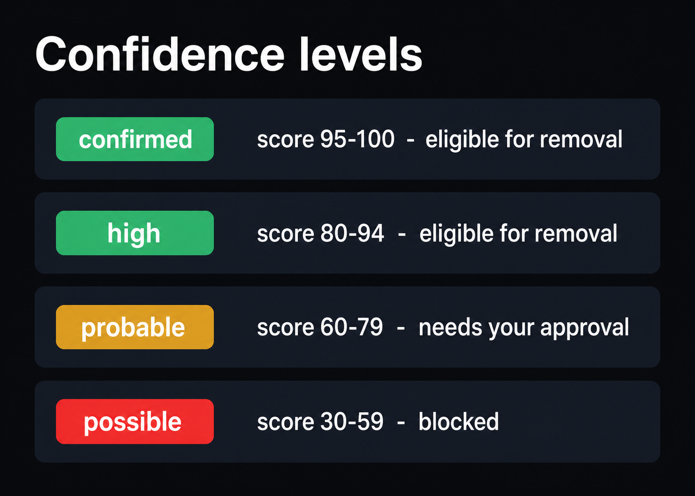

Every link DEL draws between an application and a resource is an **association**, and
every association carries a **confidence** level backed by concrete **evidence**.
Confidence is what decides whether a resource can be removed automatically, needs
your approval first, or is blocked outright. Understanding the badges is the key to
reading a removal plan safely.

## The confidence levels

<Frame caption="The four confidence levels and what each one means for removal.">
  
</Frame>

| Badge | Score | What it means | Removal eligibility |
|---|---|---|---|
| `confirmed` | 95–100 | Strong, direct evidence (e.g. a Compose project label). | Eligible for automatic inclusion in a plan. |
| `high` | 80–94 | Strong indirect evidence (e.g. an nginx `proxy_pass` port matching a container's published port). | Eligible for automatic inclusion in a plan. |
| `probable` | 60–79 | Suggestive but not conclusive. | **Requires your explicit per-resource approval** before it can be included. |
| `possible` | 30–59 | Weak signal only (e.g. name similarity alone). | **Always blocked** until you manually confirm it — never auto-removable. |
| `manual` | user-set | Declared in a [manifest](#correcting-correlation). | Treated as confirmed/high per the manifest entry. |

<Callout intent="info">
  Name similarity alone is only ever `possible` — it is never enough, by itself, for
  DEL to remove something. Correlation never promotes a `possible` association on its
  own; only your approval or a manifest entry can.
</Callout>

## Evidence

Each association lists the facts that justify its score. On an application's detail
page, expand the **Evidence** cell to see items like:

- `[docker] compose project label = deldemo (weight 100)` → `confirmed`
- `[docker] volume labeled/attached to this app's container(s) (weight 95)` → `confirmed`
- `[cron_src] cron command references path under /apps/deldemo (weight 80)` → `high`
- `[correlate] name similarity 1.00 to app 'deldemo' (unconfirmed) (weight 50)` → `possible`

The **weight** is how strongly that single fact argues for the association; the
overall confidence is derived from the combined evidence.

## Eligible vs. blocked

When DEL builds a removal plan, each associated resource falls into one of three
buckets:

- **Eligible** — `confirmed`, `high`, and `manual` associations are included
  automatically (subject to the plan options you choose).
- **Needs approval** — `probable` associations are held back until you **approve**
  them on the app detail page (Actions → *approve*).
- **Blocked** — `possible` associations, and anything DEL flags as **shared** across
  applications, are never included automatically. They appear in the plan's
  *Preserved* / *Warnings* lists instead of as deletion steps.

<Frame caption="The Actions column on the app detail page: approve, exclude, or mark shared to override DEL's automatic correlation.">
  
</Frame>

## Shared resources

If a resource is associated with more than one application, DEL sets a **shared**
flag on all of its associations and shows an amber `shared` badge. Shared resources
are **blocked from removal until explicitly approved per-application** — removing one
app will never quietly take a volume, network, or directory another app relies on.

## Correcting correlation

When DEL gets an association wrong, you have two ways to fix it:

1. **Per-resource actions** on the app detail page — *approve*, *exclude*, or
   *mark shared*.
2. **A manifest** — a YAML file in `/apps/del/manifests/` that overrides or augments
   automatic correlation. A manifest entry is recorded at `manual`/`confirmed` level
   and is the only way to force a `possible` or excluded resource into an eligible
   association. See the manifest schema in the
   [Architecture reference](/reference/architecture).

With confidence understood, you're ready for the flagship walkthrough:
[Removing an Application](/guides/removing-an-application).
