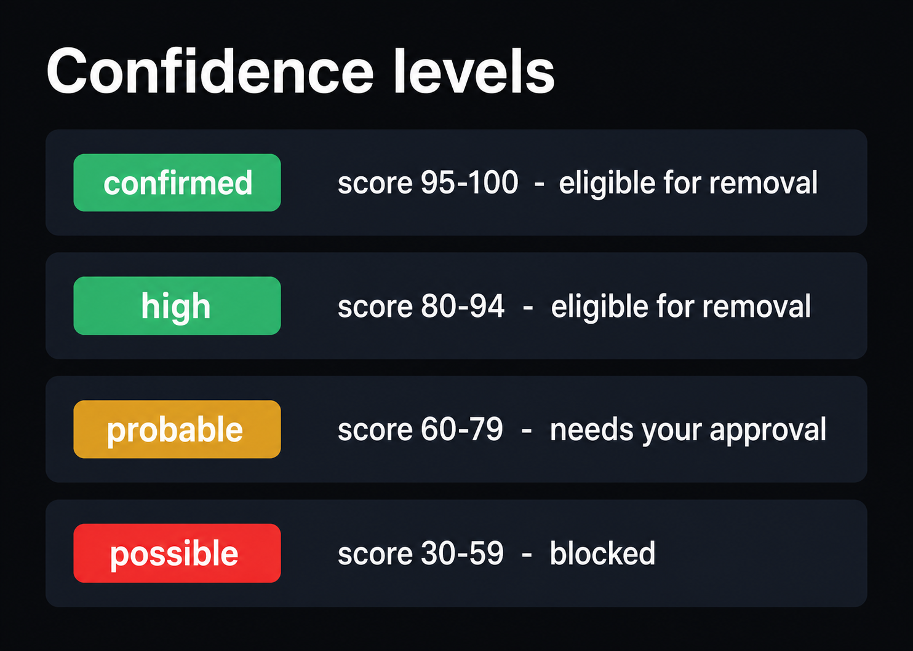

Every link DEL draws between an application and a resource is an **association**, and
every association carries a **confidence** level backed by concrete **evidence**.
Confidence is what decides whether a resource can be removed automatically, needs
your approval first, or is blocked outright. Understanding the badges is the key to
reading a removal plan safely.

## The confidence levels

<Frame caption="The four confidence levels and what each one means for removal.">
  
</Frame>

| Badge | Score | What it means | Removal eligibility |
|---|---|---|---|
| `confirmed` | 95–100 | Strong, direct evidence (e.g. a Compose project label). | Included in a plan automatically. |
| `high` | 80–94 | Strong indirect evidence (e.g. an nginx `proxy_pass` port matching a container's published port). | Included in a plan automatically. |
| `probable` | 60–79 | Suggestive but not conclusive. | **Never included.** Always preserved with a warning — see the callout below. |
| `possible` | 30–59 | Weak signal only (e.g. name similarity alone). | **Always blocked** — never auto-removable. |
| `manual` | manifest-declared | Declared in a [manifest](#correcting-correlation). | Treated exactly like confirmed/high. Note it is **displayed as `confirmed`** — see below. |

<Callout intent="warning">
  **Approving a `probable` resource does not make it removable.** The plan builder
  returns "requires per-resource approval" for every `probable` association
  unconditionally — it never checks whether you approved it. A `probable` row stays
  in the plan's *Preserved* list no matter what you click.

  To actually include one, declare the resource in the application's
  [manifest](#correcting-correlation), which records it at confidence 100.
</Callout>

<Callout intent="info">
  Name similarity alone is only ever `possible` — it is never enough, by itself, for
  DEL to remove something. Correlation never promotes a `possible` association on its
  own, and neither does the approve button; only a manifest entry can.
</Callout>

<Callout intent="info">
  **Manifest entries show a `confirmed` badge, not `manual`.** Correlation marks
  them `manual` internally, but the scanner stores every association it writes with
  `source = "correlate"`, and the display level is derived from `source == "manual"`.
  Since manifest entries carry confidence 100, they land in the `confirmed` band.
  Removal behaviour is identical; only the badge differs from what you might expect.
</Callout>

## Evidence

Each association lists the facts that justify its score. On an application's detail
page, expand the **Evidence** cell to see items like:

- `[docker] compose project label = deldemo (weight 100)` → `confirmed`
- `[docker] volume labeled/attached to this app's container(s) (weight 95)` → `confirmed`
- `[cron_src] cron command references path under /apps/deldemo (weight 80)` → `high`
- `[correlate] name similarity 1.00 to app 'deldemo' (unconfirmed) (weight 50)` → `possible`

The **weight** is how strongly that single fact argues for the association; the
overall confidence is derived from the combined evidence.

## Eligible vs. blocked

When DEL builds a removal plan, each associated resource falls into one of two
buckets — it either becomes a deletion step, or it is preserved with a warning.

**Becomes a step** — a `confirmed`, `high` or `manual` association that is not
excluded, not marked `blocked`, and not (shared and unapproved).

**Preserved** — everything else, each with the reason recorded in the plan's
*Warnings* list:

| Situation | Warning you'll see |
|---|---|
| `probable` | `requires per-resource approval` — but see the callout above: approving does not clear it |
| `possible` / `unrelated` | `confidence too low for automatic removal` |
| Shared, and not approved for this app | `shared resource requires per-resource approval` |
| You excluded it | `excluded by user` |
| Correlation marked it not safely removable | `blocked: not safely removable` |

### What the per-row *approve* button actually does

There are exactly two things:

1. **Unblocks a shared resource.** A `confirmed`/`high`/`manual` association flagged
   `shared` is held back by default; approving it clears that for this app's plan.
   This is the button's real job.
2. **Approves a named volume** for deletion (the per-volume checkboxes on the plan
   form do the same thing).

It also clears `excluded` on the row. It does **not** promote a `probable`,
`possible` or `unrelated` association.

<Frame caption="The Actions column on the app detail page: approve, exclude, or mark shared to override DEL's automatic correlation.">
  
</Frame>

<Callout intent="warning">
  **These per-row actions do not survive a scan.** *approve*, *exclude* and *mark
  shared* write onto an association row, and every scan deletes and re-inserts each
  application's associations from scratch. Use them right before building a plan.
  For a correction that has to persist, put it in the app's manifest — `shared:`
  and `excluded:` are manifest fields for exactly this reason.
</Callout>

## Shared resources

If a resource is associated with more than one application, DEL sets a **shared**
flag on all of its associations and shows an amber `shared` badge. Shared resources
are **blocked from removal until explicitly approved per-application** — removing one
app will never quietly take a volume, network, or directory another app relies on.

## Correcting correlation

When DEL gets an association wrong, you have two ways to fix it:

1. **Per-resource actions** on the app detail page — *approve*, *exclude*, or
   *mark shared*. Immediate, but reset by the next scan, and limited to the two
   things listed above.
2. **A manifest** — a YAML file in `/apps/del/manifests/` that overrides or augments
   automatic correlation at confidence 100. This is the only way to make a
   `probable` or `possible` resource removable, and the only correction that
   survives a rescan. See the manifest schema in the
   [Architecture reference](/reference/architecture).

With confidence understood, you're ready for the flagship walkthrough:
[Removing an Application](/guides/removing-an-application).
