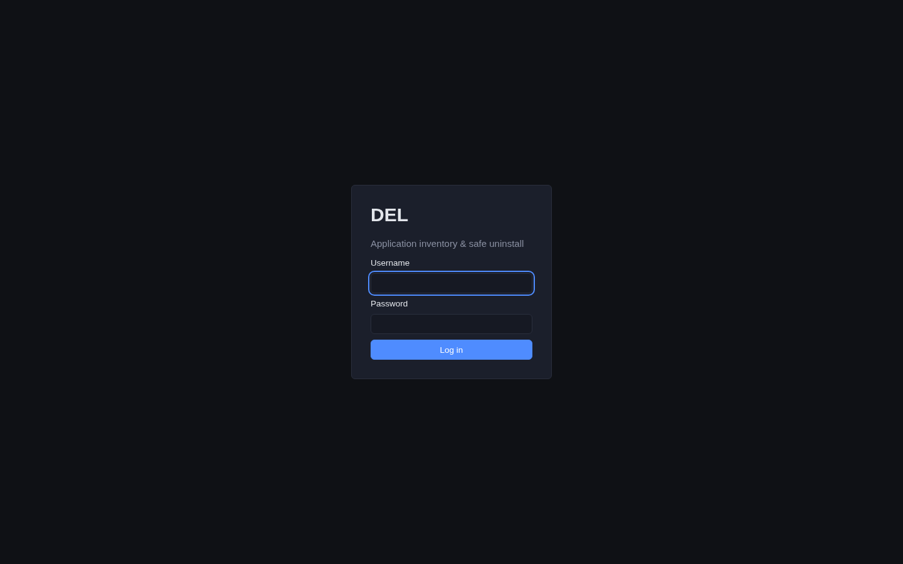

DEL is protected by a single admin login. Open **https://del.bjk.ai** and you land
on the sign-in screen.

<Frame caption="The DEL login screen.">
  
</Frame>

## Signing in

<Steps>
  <Step title="Enter your credentials">
    Type the admin **username** and **password** created during setup with
    `del-admin create-admin`, then choose **Log in**. There are no default or
    hard-coded credentials — if you have not created an account yet, see
    [Installation](/installation).
  </Step>
  <Step title="You arrive at the Dashboard">
    A successful login drops you on the Dashboard. Sessions last 12 hours; after
    that you'll be asked to sign in again.
  </Step>
</Steps>

<Callout intent="warning">
  If an initial password was generated for you at
  `/apps/del/config/admin-initial-password.txt`, log in, change it immediately with
  `del-admin change-password`, and delete that file. See the
  [Security Model](/reference/security).
</Callout>

## Finding your way around

The left sidebar is the same on every page:

| Nav item | What it shows |
|---|---|
| **Dashboard** | Stat cards, recent scans, recent jobs, and the **Run scan now** button. |
| **Applications** | Every application DEL has correlated, with status, domains, ports, and warning counts. |
| **Resources** | All discovered resources, organized into per-type tabs (containers, images, volumes, nginx sites, units, and so on). |
| **Orphans** | Resources DEL could not tie to any application — review-only. |
| **Jobs** | Every removal job (dry-run and live), with status and timing. |
| **Settings** | Configuration, scan roots, protected apps, and a second **Run scan now** button. |

**Log out** lives at the bottom of the sidebar.

The dashboard's stat cards are clickable shortcuts: **Applications** and
**Running jobs** jump to those lists, **Shared resources** opens the volumes tab
filtered to shared, **Reclaimable** opens dangling images, and so on. From here the
usual next step is to [run a scan](/guides/scanning) and then
[browse your inventory](/guides/browsing).
