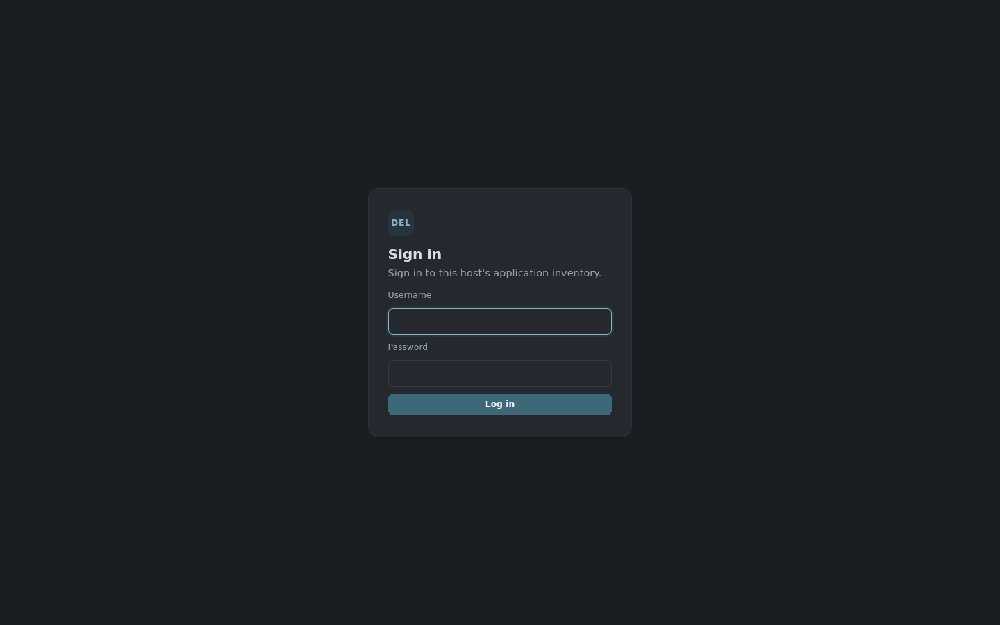

DEL is protected by a single admin login. Open **https://del.bjk.ai** and you land
on the sign-in screen.

<Frame caption="The DEL login screen.">
  
</Frame>

## Signing in

<Steps>
  <Step title="Enter your credentials">
    Type the admin **username** and **password** created during setup with
    `del-admin create-admin`, then choose **Log in**. There are no default or
    hard-coded credentials — if you have not created an account yet, see
    [Installation](/installation).
  </Step>
  <Step title="You arrive at the Dashboard">
    A successful login drops you on the Dashboard: vocabulary chips, then **How to use DEL** open in a `
` block. Sessions last 12 hours; after
    that you'll be asked to sign in again.
  </Step>
</Steps>

<Callout intent="info">
  Nothing writes your password to disk — `del-admin` reads it from a prompt or stdin
  and stores only an Argon2id hash. (An earlier setup left a generated password at
  `/apps/del/config/admin-initial-password.txt`; that file has been deleted and is
  not recreated. If you find one on an older host, log in, run `del-admin
  change-password`, and delete it.) See the [Security Model](/reference/security).
</Callout>

<Callout intent="info">
  Login is rate-limited to 5 attempts per minute per IP. If you lock yourself out,
  wait 60 seconds — there is no escalating backoff and no lasting lockout.
</Callout>

## Finding your way around

The left sidebar is the same on every page:

| Nav item | What it shows |
|---|---|
| **Dashboard** | Legend chips (shared / probable / possible / no probable owner → Orphans / Ask), **How to use DEL** in an open `
` panel with **Run scan now**, then stat cards, recent scans, recent jobs. |
| **View Apps** | A homelab-style launcher gallery of the web apps this host currently serves, filtered to domains that pass a live HTTPS check. See [Browsing the Inventory](/guides/browsing). |
| **Applications** | Every application DEL has correlated, with status, domains, ports, and warning counts. |
| **Resources** | All discovered resources, organized into per-type tabs (containers, images, volumes, nginx sites, units, and so on). |
| **Orphans** | Resources with no current, confident owner — review-only. See [Orphan Review](/guides/orphans). |
| **Assistant** | Full-page read-only inventory Q&A. The same chat is the **Ask** tab of the right-rail Help\|Ask dock on every other page. |
| **Jobs** | Every removal job (dry-run and live), with status and timing. |
| **Settings** | Configuration, scan roots, protected apps, and a second **Run scan now** button. |
| **Docs** | Opens this documentation site in a new tab. It is served openly, with no separate login — the app UI still needs your DEL session. |

**Log out** lives at the bottom of the sidebar. On the right, **Help** is the page glossary and **Ask** is the assistant (floating **Help** / **Ask** buttons on small screens).

The interface is keyboard-navigable: a **Skip to main content** link appears on
first Tab, the glossary sheet and mobile nav drawer trap focus and return it when
closed, and copy buttons are reachable without a mouse.

The dashboard's stat cards are clickable shortcuts: **Applications** and
**Running jobs** jump to those lists, **Shared resources** opens the volumes tab
filtered to shared, **Reclaimable** opens dangling images, and so on. From here the
usual next step is to [run a scan](/guides/scanning) and then
[browse your inventory](/guides/browsing).
