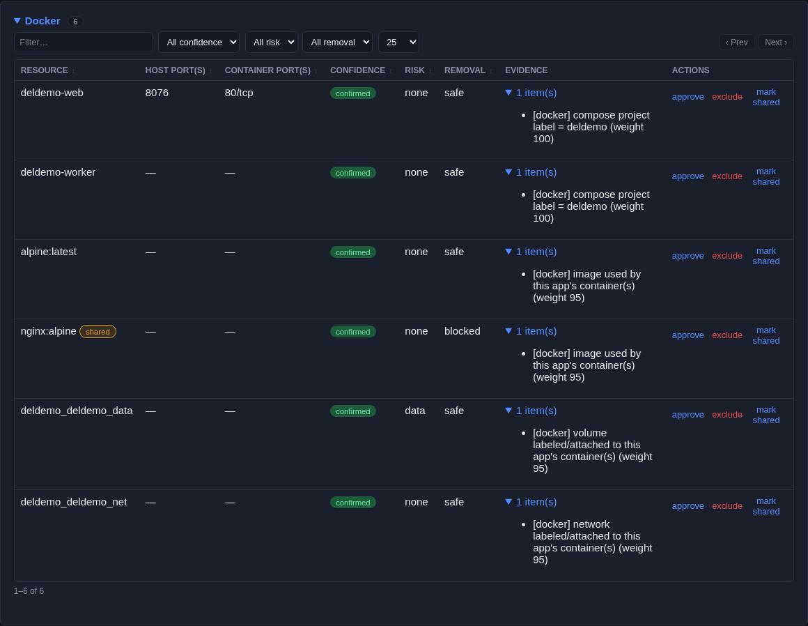
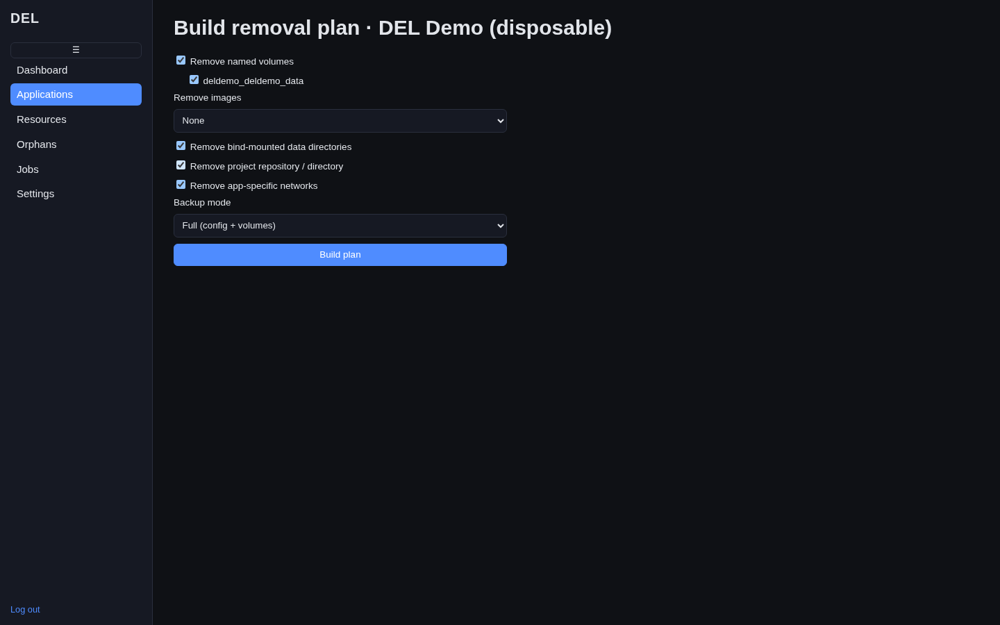
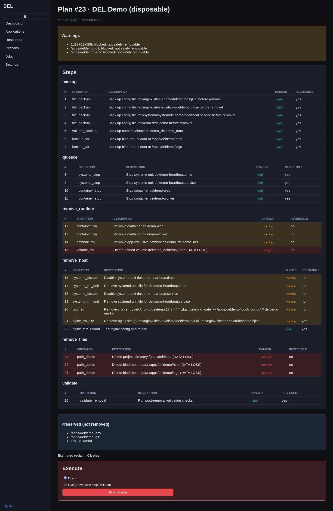
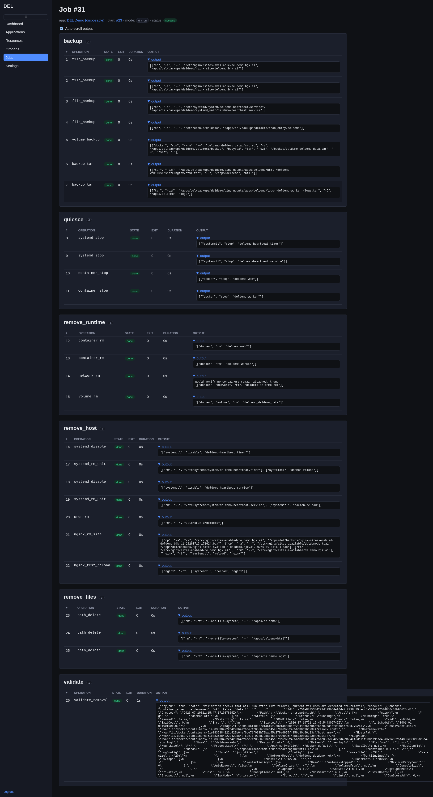
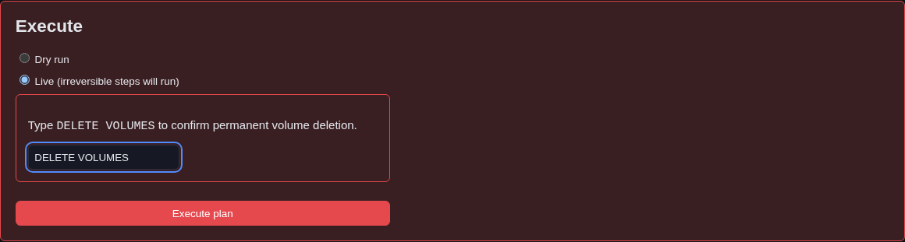
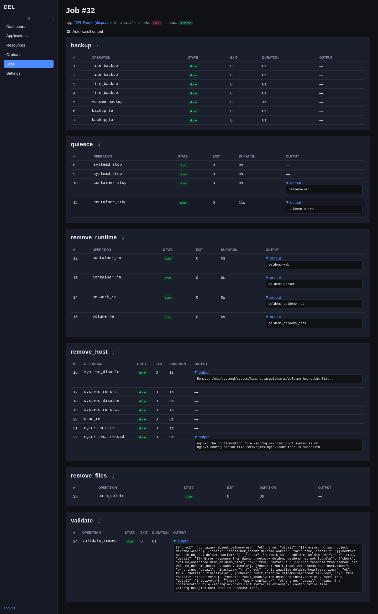

This is the page most people come to DEL for: **how do I actually delete an app,
end to end, through the interface?** Below is the entire flow — from reviewing what
an app owns, to a green live removal — with a screenshot of every screen you'll
touch. The example app throughout is a disposable demo called *DEL Demo*.

<Callout intent="warning">
  A live removal permanently deletes containers, images, volumes, networks, nginx
  sites, systemd units, cron jobs, and directories. DEL makes this safe with
  backups, dry-runs, and typed confirmation — but it is still deletion. Work through
  the steps; don't skip the dry-run.
</Callout>

## The easy way: "Complete removal (everything)"

If your goal is to wipe an application off the host **entirely**, don't hand-pick
options one at a time — the plan builder has a single checkbox for exactly this.

<Steps>
  <Step title="Open the plan builder and check the box">
    On the app detail page, click **Plan removal**, then tick
    **Complete removal (everything)** at the top of the form. This one click selects
    every teardown option for you: **Remove named volumes** (on, with every
    per-volume checkbox ticked — no separate approval step needed), **Remove
    images: Exclusive to this app**, **Remove bind-mounted data directories** (on),
    **Remove project repository / directory** (on), **Remove app-specific
    networks** (on), and **Backup mode: Full (config + volumes)**.
  </Step>
  <Step title="Build the plan, dry-run it, then run it live">
    Click **Build plan**, read the preview (below), dry-run it, then run it live and
    type **`DELETE VOLUMES`** at the execute gate — the one confirmation still
    required for the one irreversible operation, even on a one-click plan.
  </Step>
</Steps>

<Callout intent="warning">
  **Complete removal permanently deletes all data for this app.** The preset takes a
  full backup first (so it's recoverable from `/apps/del/backups/`), but it still
  requires the dry-run and the typed live-execution phrase below — the checkbox
  chooses *what* to remove, not *whether* to skip DEL's safety gates.
</Callout>

Per-volume approval happens right here on the plan form — ticking (or preset-ticking)
a volume's checkbox **is** the approval; there's no separate "approve this volume"
step elsewhere. Live deletion of any ticked volume additionally requires the typed
`DELETE VOLUMES` phrase at execution time (Step 6 below) — that's the one extra gate
that can't be skipped by a preset.

<Callout intent="error">
  **What DEL never auto-removes, even on a "remove everything" plan:**
  - **Shared resources** — anything used by more than one app is *preserved* unless
    you explicitly approve it for this app (it would break the other app otherwise).
  - **`possible`-confidence resources** — weak matches are blocked, not deleted.
  - **`.env` and `.git`** inside a project directory — preserved and listed under
    *Preserved* / *Manual follow-up* so you can review secrets and history before
    deleting them by hand.
  - **External DNS** (e.g. the app's `*.bjk.ai` record in your DNS provider), **TLS
    certificates**, and anything outside DEL's approved deletion roots — remove those
    yourself.
</Callout>

**Verify it's really gone afterwards:** read the job's final **validate** stage
(it checks each target is actually absent), then run a fresh
[scan](/guides/scanning) — the application should no longer appear in
**Applications**, and its resources should be gone from **Resources**. Anything DEL
intentionally preserved will show up as an [orphan](/guides/orphans) or in the plan's
manual-follow-up list for you to finish by hand.

## The whole flow at a glance

<Steps>
  <Step title="Open the application and review what it owns">
    From **Applications**, click the app you want to remove. Its detail page groups
    every associated resource into sections — Docker, systemd, Nginx, Scheduled,
    Processes, Files / Storage, and Shared resources — each with a **confidence**
    badge, a **risk** level, a **removal** eligibility, and expandable **evidence**.

    Read this page before doing anything else. Confirm the resources listed really do
    belong to this app, and note anything marked `shared`, `probable`, or `possible`.

    <Frame caption="Step 1 — the application detail page, sections and evidence expanded.">
      
    </Frame>
  </Step>

  <Step title="Approve anything DEL held back">
    `confirmed` and `high` resources are included automatically. Anything `probable`
    is held back until you **approve** it, and `shared` resources stay preserved
    unless you explicitly approve them for this app. Use the **Actions** on each row —
    *approve*, *exclude*, or *mark shared* — to get the association set exactly right.

    <Frame caption="Step 2 — approve, exclude, or mark-shared each association from the Actions column.">
      
    </Frame>

    <Callout intent="info">
      Not sure what a badge means? See
      [Understanding Confidence](/guides/confidence). Only `confirmed`/`high`/`manual`
      (and approved `probable`) associations become removal steps; `possible` and
      unapproved `shared` resources are always preserved.
    </Callout>
  </Step>

  <Step title="Choose your plan options">
    Click **Plan removal** to open the plan builder. Each option controls exactly
    what the plan will touch:

    | Option | What it removes | Danger |
    |---|---|---|
    | **Remove named volumes** | Docker named volumes owned by the app. Reveals a checkbox per volume — you must tick each volume you want gone. | **Data loss** — irreversible. Also gated by a typed phrase at execution (Step 6). |
    | *(per-volume checkboxes)* | The specific volumes approved for deletion. Unchecked volumes are preserved. | Data loss for each ticked volume. |
    | **Remove images** — *None* / *Exclusive to this app* | With *Exclusive*, deletes images used only by this app. Images still referenced by another container are refused. | Low; images can be re-pulled. |
    | **Remove bind-mounted data directories** | Host directories bind-mounted into the app's containers. | **Data loss** — these hold real data on disk. |
    | **Remove project repository / directory** | The app's project directory (its Compose files, source, `.env`). | **Data loss** — `.git` and `.env` are preserved and reported as manual follow-up. |
    | **Remove app-specific networks** | Docker networks exclusive to the app. Refuses `bridge`/`host`/`none` and networks with foreign containers still attached. | Low. |
    | **Backup mode** — *None* / *Config only* / *Full (config + volumes)* | How much is backed up before anything is deleted. **Full** also archives volume contents. | Choosing *None* removes your safety net — prefer **Full**. |

    <Frame caption="Step 3 — the plan builder with full options selected and Backup mode set to Full.">
      
    </Frame>

    <Callout intent="warning">
      Prefer **Backup mode: Full** for any removal that touches volumes or data
      directories. Backups are cheap; a wrong deletion without one is not. See
      [Backups & Restore](/guides/backups).
    </Callout>
  </Step>

  <Step title="Read the plan preview">
    Building the plan takes you to the preview. Nothing has run yet. Read it
    top to bottom:

    - **Warnings** (amber box) — resources DEL is deliberately *not* removing and
      why, e.g. `/apps/deldemo/.git: blocked: not safely removable`.
    - **Steps**, grouped by stage (backup → quiesce → remove_runtime → remove_host →
      remove_files → validate). Each step shows its operation, a plain-English
      description, a **Danger** badge (`safe` / `warning` / `data_loss`), and whether
      it's **reversible**. Data-loss rows are tinted red.
    - **Preserved (not removed)** — everything intentionally kept, such as `.env` and
      `.git`.
    - **Manual follow-up required** — anything you'll need to finish by hand.
    - **Estimated reclaim** — the space the removal is expected to free.

    <Frame caption="Step 4 — the plan preview: warnings, staged steps with danger badges, preserved items, and the Execute box.">
      
    </Frame>
  </Step>

  <Step title="Dry-run first — always">
    At the bottom of the preview is the **Execute** box. Leave the mode on **Dry run**
    (the default) and click **Execute plan**. A dry-run walks every stage and records
    each step *without changing anything on the host* — backups, quiesce, removes, and
    validation all execute in simulation.

    Open the resulting job and confirm **every step is `done` (green)** and the status
    is `success`. A dry-run is your last, zero-risk chance to catch a surprise.

    <Frame caption="Step 5 — a dry-run job: every stage and step green, nothing actually deleted.">
      
    </Frame>

    <Callout intent="warning">
      Never skip the dry-run. If a dry-run step fails or a warning surprises you, fix
      the cause (approve/exclude a resource, edit the manifest, rescan) and rebuild the
      plan **before** running live.
    </Callout>
  </Step>

  <Step title="Run it live with the typed confirmation">
    Go back to the plan and, in the **Execute** box, select **Live (irreversible steps
    will run)**. If the plan deletes any named volume, a red box appears demanding you
    **type the exact phrase `DELETE VOLUMES`** — this is a second, explicit
    confirmation on top of the plan option and the per-volume checkbox. Type it, then
    click **Execute plan**.

    <Frame caption="Step 6 — the live execute gate: selecting Live reveals the typed DELETE VOLUMES confirmation.">
      
    </Frame>

    <Callout intent="error">
      Volume deletion is the one irreversible-by-default operation in DEL. It requires
      **all three** of: the *Remove named volumes* option, the per-volume checkbox, and
      the typed `DELETE VOLUMES` phrase entered here at execution time. Without the
      phrase, a live run that would delete a volume is refused.
    </Callout>
  </Step>

  <Step title="Read the final job and its validation">
    The live job page streams each step to `done` in stage order. When it finishes,
    the status badge reads `success`. The final **validate** stage runs post-removal
    checks — container absent, volume absent, unit inactive, `nginx -t` still passes —
    and records the result; expand its output to confirm every check returned `ok`.

    <Frame caption="Step 7 — the completed live job: every stage done through validate, status success.">
      
    </Frame>

    The application is now removed.
  </Step>
</Steps>

## After a successful removal: what the UI does next

A successful **live** removal job automatically triggers a rescan — you don't need
to run one yourself. Because of that, the UI updates immediately:

- The app **disappears from Applications** on its own, since that list only shows
  apps present in the latest scan.
- Visiting the app's URL directly (e.g. from a bookmark or an old link) shows its
  detail page with a **"not present in the latest scan"** banner instead of an
  error — its history (jobs, plans, backups) is still there, it just isn't treated
  as a currently-installed app anymore.
- Add `?show=removed` to the **Applications** URL if you want to see removed apps
  listed alongside active ones.

<Callout intent="info">
  If you don't see this — the app still listed as if nothing happened — check the
  job actually finished `success` and was a **live** run, not a dry-run. Dry-runs
  never trigger a rescan because they never change anything.
</Callout>

## If a step fails

DEL is built to fail safe. If any step fails, the job **halts before running further
deletions in that run** — it never barrels ahead.

- **Automatic rollback** — nginx and systemd removal steps restore themselves from
  the backup taken in the *backup* stage if a later step in the same job fails (for
  example, if `nginx -t` fails after a site removal). This is built into the job
  engine, not a manual step.
- **Resume / retry** — a failed job is **resumable**: fix the underlying cause, then
  retry and the job re-enters at the failed step without re-running the steps that
  already succeeded.
- **Manual rollback of a finished job** — to reverse a job that already completed, use
  its backups (config files, tarred directories, and volume archives under
  `/apps/del/backups/`). The full procedure is in
  [Backups & Restore](/guides/backups) and [Recovery](/guides/recovery).

<Callout intent="info">
  A restore of DEL's own database never undoes a real removal — those changes were
  made to actual host resources, not database rows. To undo a removal, use the job's
  backups, not a DB restore.
</Callout>

## Why this is safe

The removal engine layers several independent safeguards: dry-run by default,
per-stage backups before any mutation, HMAC-signed plans that the privileged helper
still re-validates argument-by-argument, a fixed operation allowlist, protected roots
that can never be deleted, the typed volume-deletion phrase, and halt-on-failure with
automatic rollback. For the full stage-by-stage engine detail and the privilege
split behind it, see the [Architecture reference](/reference/architecture).
