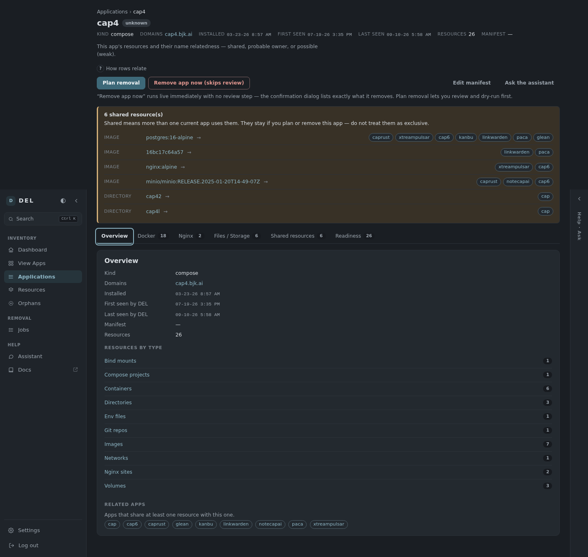
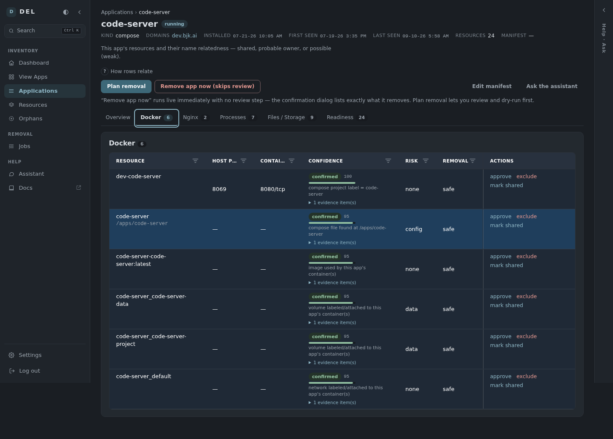
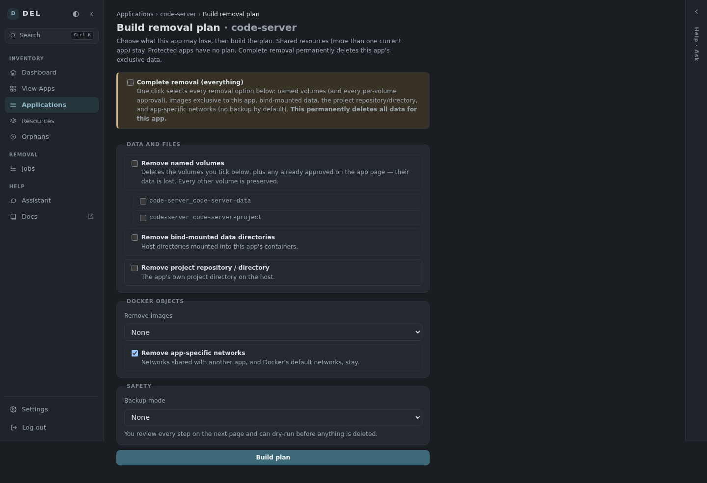
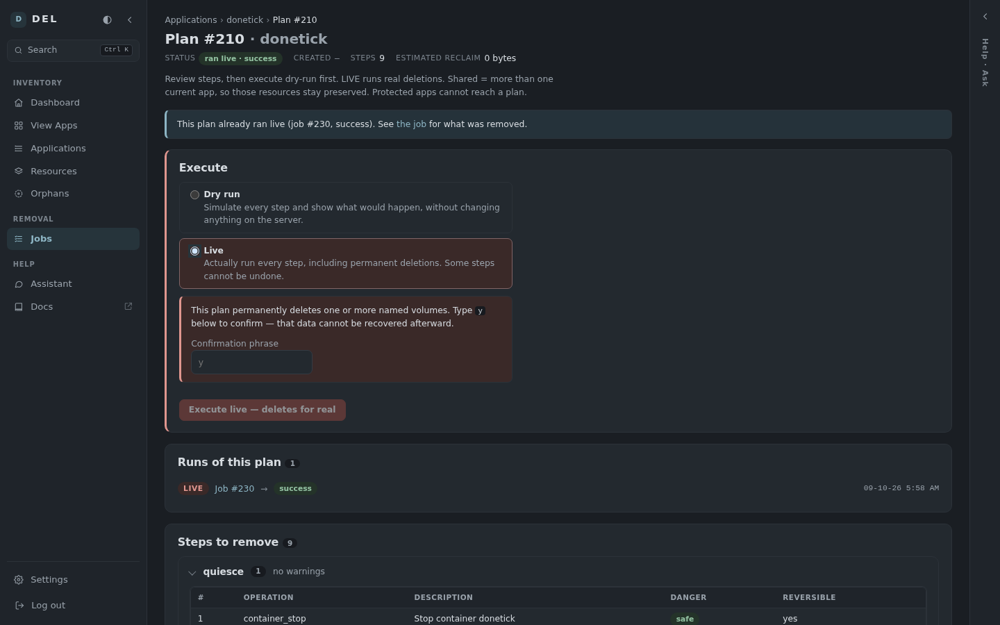
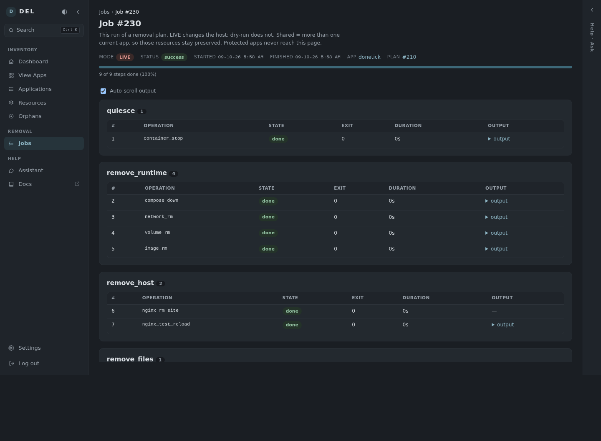

This is the page most people come to DEL for: **how do I actually delete an app,
end to end, through the interface?** Below is the entire flow — from reviewing what
an app owns, to a green live removal — with a screenshot of every screen you'll
touch. The example app throughout is a disposable demo called *DEL Demo*.

<Callout intent="warning">
  A live removal permanently deletes containers, images, volumes, networks, nginx
  sites, systemd units, cron jobs, and directories. DEL makes this safe with
  backups, dry-runs, and typed confirmation — but it is still deletion. Work through
  the steps; don't skip the dry-run.
</Callout>

## The fastest way: "Remove app now"

If your goal is to wipe an application off the host **entirely** and you don't
need a preview or a dry-run first, the app detail page has a single button for
exactly this: **Remove app now (skips review)**, next to **Plan removal**
in the action bar. For `protected` apps, and for apps no longer present in the
latest scan, the button is disabled with a note and the plan link is not shown.

Clicking it shows one native browser confirm dialog listing what will be
deleted — containers, images, named volumes, bind-mounted data, the project
directory, and app networks, with shared resources preserved — and, on
confirm, immediately builds and **runs live** a complete-removal plan: every
discovered named volume approved, images set to *Exclusive to this app*, bind
data, repository, and networks all on, and no backup. There is no dry-run
step and no typed `y` phrase to type — the one confirm dialog is the only
prompt, and the typed-phrase gate that the step-by-step flow enforces at
execute time is supplied automatically for this route. It is otherwise built
by the same plan engine as the step-by-step flow below, so the same
preservation rules apply: shared resources, `probable`/`possible`-confidence
resources, `.env`/`.git`, and anything failing the safe-delete path check are
still preserved, not deleted. You land on the job page, which links to the
plan (`/plans/{id}`) — open it to see the **Preserved (not removed)** list.

<Callout intent="warning">
  **Remove app now skips the dry-run and preview that the step-by-step flow
  gives you.** Use it when you're already confident about what the app owns
  (e.g. you've reviewed its detail page and nothing is misattributed). If you
  want to see the plan, warnings, and preserved list *before* anything runs,
  use **Plan removal…** instead — described next.
</Callout>

## The step-by-step way: "Complete removal (everything)"

If you'd rather preview the plan and dry-run it first, but still don't want to
hand-pick options one at a time, the plan builder has a single checkbox for
exactly this.

<Steps>
  <Step title="Open the plan builder and check the box">
    On the app detail page, click **Plan removal**, then tick
    **Complete removal (everything)** at the top of the form. This one click selects
    every teardown option for you: **Remove named volumes** (on, with every
    per-volume checkbox ticked — no separate approval step needed), **Remove
    images: Exclusive to this app**, **Remove bind-mounted data directories** (on),
    **Remove project repository / directory** (on), and **Remove app-specific
    networks** (on). Backup defaults to **None** (switch to Config or Full if you
    want a safety net under `/apps/del/backups/` first).
  </Step>
  <Step title="Build the plan, dry-run it, then run it live">
    Click **Build plan**, read the preview (below), dry-run it, then run it live and
    type **`y`** at the execute gate — the one confirmation still
    required for the one irreversible operation, even on a one-click plan.
  </Step>
</Steps>

<Callout intent="warning">
  **Complete removal permanently deletes all data for this app.** The preset does
  **not** take a backup by default (set Backup mode to Config or Full first if you
  want recoverability), but it still requires the dry-run and the typed live-execution
  phrase below — the checkbox chooses *what* to remove, not *whether* to skip DEL's
  safety gates.
</Callout>

Per-volume approval happens right here on the plan form — ticking (or preset-ticking)
a volume's checkbox **is** the approval; there's no separate "approve this volume"
step elsewhere. Live deletion of any ticked volume additionally requires the typed
`y` phrase at execution time (Step 6 below) — that's the one extra gate
that can't be skipped by a preset.

<Callout intent="error">
  **What DEL never auto-removes, even on a "remove everything" plan:**
  - **Shared resources** — anything used by more than one app is *preserved* unless
    you explicitly approve it for this app (it would break the other app otherwise).
  - **`probable`- and `possible`-confidence resources** — both are preserved, and
    the *approve* button does not change that for `probable`. Only a manifest entry
    does.
  - **`.env` and `.git`** inside a project directory — preserved and listed under
    *Preserved* / *Manual follow-up* so you can review secrets and history before
    deleting them by hand.
  - **External DNS** (e.g. the app's `*.bjk.ai` record in your DNS provider), **TLS
    certificates**, and anything outside DEL's approved deletion roots — remove those
    yourself.
</Callout>

**Verify it's really gone afterwards:** read the job's final **validate** stage
(it checks each target is actually absent), then run a fresh
[scan](/guides/scanning) — the application should no longer appear in
**Applications**, and its resources should be gone from **Resources**. Anything DEL
intentionally preserved will show up as an [orphan](/guides/orphans) or in the plan's
manual-follow-up list for you to finish by hand.

## The whole flow at a glance

<Steps>
  <Step title="Open the application and review what it owns">
    From **Applications**, click the app you want to remove. Its detail page groups
    every associated resource into sections — Docker, systemd, Nginx, Scheduled,
    Processes, Files / Storage, and Shared resources — each with a **confidence**
    badge, a **risk** level, a **removal** eligibility, and expandable **evidence**.

    Read this page before doing anything else. Confirm the resources listed really do
    belong to this app, and note anything marked `shared`, `probable`, or `possible`.

    <Frame caption="Step 1 — the application detail page, sections and evidence expanded.">
      
    </Frame>
  </Step>

  <Step title="Approve any shared resource you do want removed">
    `confirmed` and `high` resources are included automatically. A resource flagged
    `shared` stays preserved unless you explicitly **approve** it for this app —
    that is what the *approve* action is for. Use the **Actions** on each row —
    *approve*, *exclude*, or *mark shared* — to get the association set right.

    <Frame caption="Step 2 — approve, exclude, or mark-shared each association from the Actions column.">
      
    </Frame>

    <Callout intent="warning">
      **Approving a `probable` association does nothing.** The plan builder preserves
      every `probable` row unconditionally — it never checks approval for them. If
      the app owns something DEL only rated `probable` and you want it gone, add it
      to the app's manifest (**Edit manifest** on the detail page) and rescan; that
      records it at confidence 100. See
      [Understanding Confidence](/guides/confidence).
    </Callout>

    <Callout intent="info">
      Do this immediately before building the plan. Every scan deletes and re-inserts
      an application's associations, so *approve* / *exclude* / *mark shared* are
      wiped by the next rescan. Manifest edits persist; these do not.
    </Callout>
  </Step>

  <Step title="Choose your plan options">
    Click **Plan removal** to open the plan builder. Each option controls exactly
    what the plan will touch:

    | Option | What it removes | Danger |
    |---|---|---|
    | **Remove named volumes** | Docker named volumes owned by the app. Reveals a checkbox per volume — you must tick each volume you want gone. | **Data loss** — irreversible. Also gated by a typed phrase at execution (Step 6). |
    | *(per-volume checkboxes)* | The specific volumes approved for deletion. Unchecked volumes are preserved. | Data loss for each ticked volume. |
    | **Remove images** — *None* / *Exclusive to this app* | With *Exclusive*, deletes images used only by this app. Images still referenced by another container are refused. | Low; images can be re-pulled. |
    | **Remove bind-mounted data directories** | Host directories bind-mounted into the app's containers. | **Data loss** — these hold real data on disk. |
    | **Remove project repository / directory** | The app's project directory (its Compose files, source, `.env`). | **Data loss** — `.git` and `.env` are preserved and reported as manual follow-up. |
    | **Remove app-specific networks** | Docker networks exclusive to the app. Refuses `bridge`/`host`/`none` and networks with foreign containers still attached. | Low. |
    | **Backup mode** — *None* (default) / *Config only* / *Full (config + volumes)* | How much is backed up before anything is deleted. **Full** also archives volume contents. | Choosing *None* removes your safety net — switch to **Full** when you may need a restore. |

    <Frame caption="Step 3 — the plan builder with full options selected.">
      
    </Frame>

    <Callout intent="warning">
      Prefer **Backup mode: Full** for any removal that touches volumes or data
      directories if you might need a restore later. Backups are cheap; a wrong
      deletion without one is not. See [Backups & Restore](/guides/backups).
    </Callout>
  </Step>

  <Step title="Read the plan preview">
    Building the plan takes you to the preview. Nothing has run yet. Read it
    top to bottom:

    - **Warnings** (amber box) — resources DEL is deliberately *not* removing and
      why, e.g. `/apps/deldemo/.git: blocked: not safely removable`. If another
      app's compose project would resolve to the same Docker Compose project
      label under a different path, a warning names both apps and paths —
      `compose_down`'s teardown sweep is host-wide by that label, so the
      collision could remove the other app's containers too.
    - **Steps**, grouped into a collapsible section per stage (backup → quiesce →
      remove_runtime → remove_host → remove_files → validate) — those are all the
      stages there are. Each stage's summary line shows a danger count (e.g. "2
      data_loss · 1 warning", or "no warnings"), and starts open. Each step shows
      its operation, a plain-English description, a **Danger** badge (`safe` /
      `warning` / `data_loss`), and whether it's **reversible**. Data-loss rows
      are tinted red.
    - **Preserved (not removed)** — everything intentionally kept, such as `.env` and
      `.git`.
    - **Manual follow-up required** — anything you'll need to finish by hand.
    - **Estimated reclaim** — the space the removal is expected to free.

    <Frame caption="Step 4 — the plan preview: warnings, staged steps with danger badges, preserved items, and the Execute box.">
      
    </Frame>
  </Step>

  <Step title="Dry-run first — always">
    At the bottom of the preview is the **Execute** box. Leave the mode on **Dry run**
    (the default) and click **Run dry run** — the button's label and its
    primary/danger styling both track the selected mode. A dry-run walks every
    stage and records each step *without changing anything on the host* —
    backups, quiesce, removes, and validation all execute in simulation.

    The plan page's **Status** is derived from the jobs that have run it, not
    stored on the plan itself: **not run yet**, **dry-run only**, or
    **ran live · &lt;job status&gt;**. A **Runs of this plan** list below the
    Execute box shows every dry-run and live job for this plan, and a callout
    appears here if the plan already ran live successfully.

    Open the resulting job and confirm **every step is `done` (green)** and the status
    is `success`. A dry-run is your last, zero-risk chance to catch a surprise.

    <Frame caption="Step 5 — a dry-run job: every stage and step green, nothing actually deleted.">
      
    </Frame>

    <Callout intent="warning">
      Never skip the dry-run. If a dry-run step fails or a warning surprises you, fix
      the cause (approve/exclude a resource, edit the manifest, rescan) and rebuild the
      plan **before** running live.
    </Callout>
  </Step>

  <Step title="Run it live with the typed confirmation">
    Go back to the plan and, in the **Execute** box, select **Live**. The execute
    button relabels itself to **Execute live — deletes for real**. If the plan
    deletes any named volume, a red box appears demanding you **type `y`** —
    this is a second, explicit confirmation on top of the plan option and the
    per-volume checkbox. Type it, then click **Execute live — deletes for
    real**; only a live run asks for a browser confirmation dialog before
    submitting.

    <Frame caption="Step 6 — the live execute gate: selecting Live reveals the typed y confirmation.">
      
    </Frame>

    <Callout intent="error">
      Volume deletion is the one irreversible-by-default operation in DEL. It requires
      **all three** of: the *Remove named volumes* option, the per-volume checkbox, and
      the typed `y` phrase entered here at execution time. Without the
      phrase, a live run that would delete a volume is refused.
    </Callout>
  </Step>

  <Step title="Read the final job and its validation">
    The live job page streams each step to `done` in stage order. A progress bar and
    a "Running: stage · operation" line update live above the step tables (both are
    `aria-live` regions, so a screen reader announces each change), and the job's
    status badge itself is `aria-live` too. Polling starts every 2 seconds and backs
    off to every 10 seconds the longer the job runs; it pauses entirely if you switch
    away from the tab and resumes immediately when you switch back. When the job
    reaches a terminal state (`success`, `failed`, …) a toast confirms it and polling
    stops. The final **validate** stage runs post-removal checks — container absent,
    volume absent, unit inactive, `nginx -t` still passes — and records the result;
    expand its output to confirm every check returned `ok`.

    <Frame caption="Step 7 — the completed live job: every stage done through validate, status success.">
      
    </Frame>

    The application is now removed.
  </Step>
</Steps>

## After a successful removal: what the UI does next

A successful **live** removal job automatically triggers a rescan — you don't need
to run one yourself. Because of that, the UI updates immediately:

- The app **disappears from Applications** on its own, since that list only shows
  apps present in the latest scan.
- Visiting the app's URL directly (e.g. from a bookmark or an old link) shows its
  detail page with a **"not present in the latest scan"** banner instead of an
  error — its history (jobs, plans, backups) is still there, it just isn't treated
  as a currently-installed app anymore.
- Add `?show=removed` to the **Applications** URL if you want to see removed apps
  listed alongside active ones.

<Callout intent="info">
  If you don't see this — the app still listed as if nothing happened — check the
  job actually finished `success` and was a **live** run, not a dry-run. Dry-runs
  never trigger a rescan because they never change anything.
</Callout>

## If a step fails

DEL is built to fail safe. If any step fails, the job **halts before running further
deletions in that run** — it never barrels ahead.

- **`nginx_rm_site` rolls itself back.** The helper backs up each site file, removes
  them, runs `nginx -t`, and copies them straight back if the test fails. This is
  self-contained inside the operation and does not depend on anything else.
- **Job-level rollback of nginx/systemd steps** — if an `nginx_rm_site`,
  `nginx_test_reload`, `systemd_disable` or `systemd_rm_unit` step fails, the engine
  restores this job's recorded backups newest-first and reports the real per-backup
  outcome in the audit log. **This only has anything to restore if you set the
  plan's backup mode to Config or Full**, which is not the default. Volume archives
  are skipped — a volume backup is a tar of contents, not a filesystem path, so you
  restore those by hand.
- **Manual rollback of a finished job** — to reverse a job that already completed, use
  its backups (config files, tarred directories, and volume archives under
  `/apps/del/backups/`). The full procedure is in
  [Backups & Restore](/guides/backups) and [Recovery](/guides/recovery).

<Callout intent="warning">
  **There is no retry button.** The engine has a `retry_job()` function that resets
  the failed step and everything after it and re-runs from there, but nothing in the
  UI, the HTTP API or the `del-admin` CLI calls it — there is no `/jobs/{id}/retry`
  route. In practice you fix the cause, rescan, and build a fresh plan — which will
  no longer contain steps for whatever the failed job already removed.
</Callout>

<Callout intent="info">
  A restore of DEL's own database never undoes a real removal — those changes were
  made to actual host resources, not database rows. To undo a removal, use the job's
  backups, not a DB restore.
</Callout>

## Why this is safe

The removal engine layers several independent safeguards: dry-run by default;
backups before any mutation when you ask for them; HMAC-signed plans, verified
web-side before a job is created and again before it runs; a fixed 22-operation
allowlist enforced by a root daemon that re-validates every argument on its own
terms and has no knowledge of your plan; protected roots and protected units that
can never be touched; the typed volume-deletion phrase; and halt-on-failure. The
plan builder also refuses outright if the app has no resources in the latest
completed scan, rather than producing an empty plan that would "succeed" having
removed nothing.

For the full stage-by-stage engine detail and the privilege split behind it, see the
[Architecture reference](/reference/architecture).
