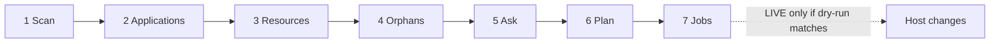
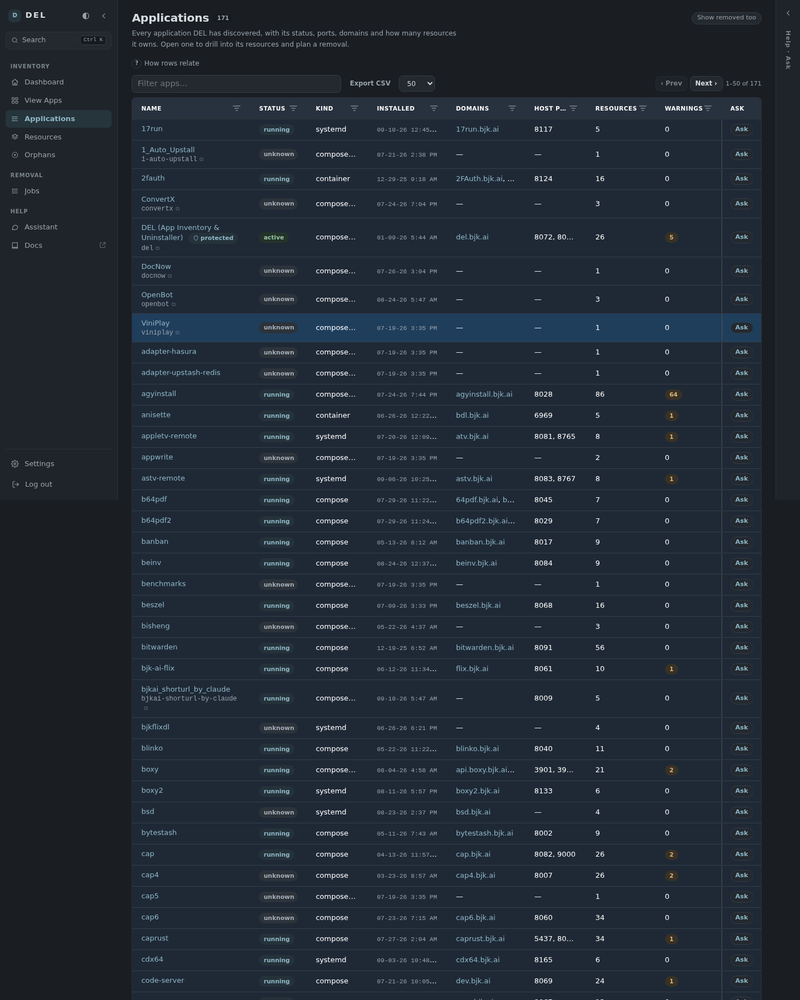
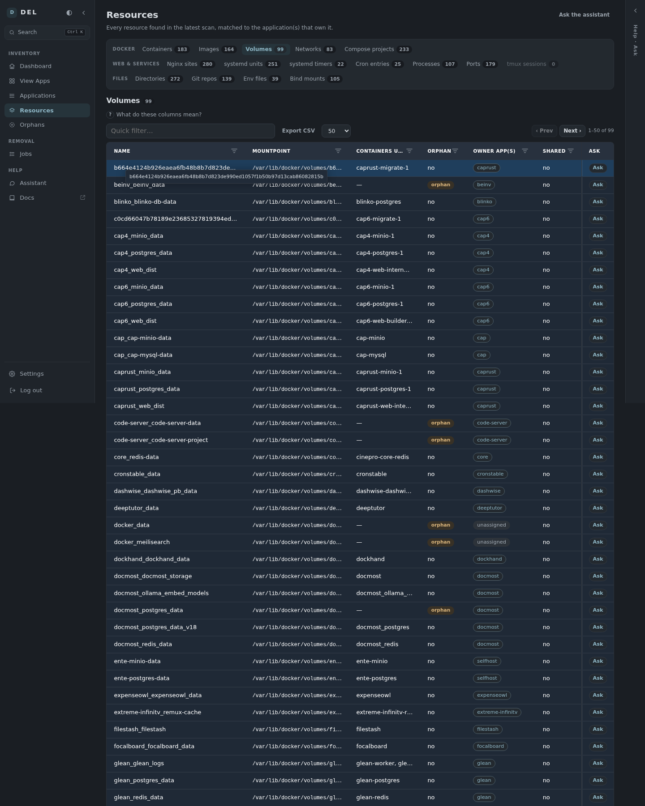
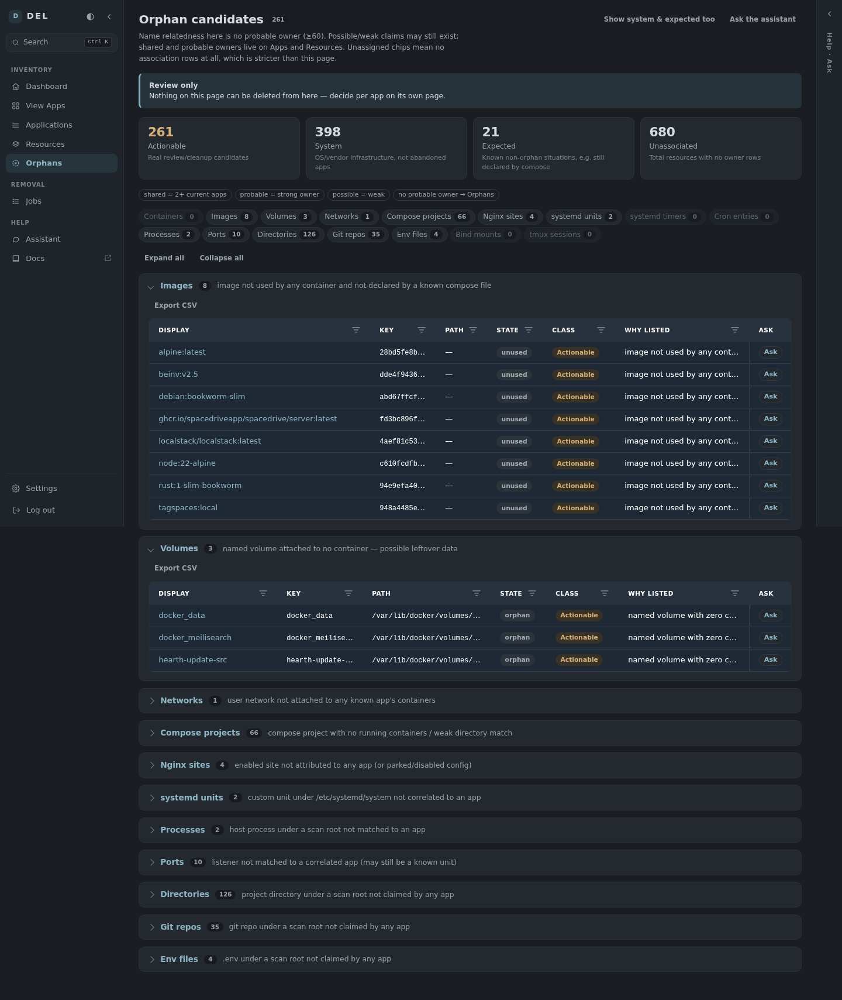
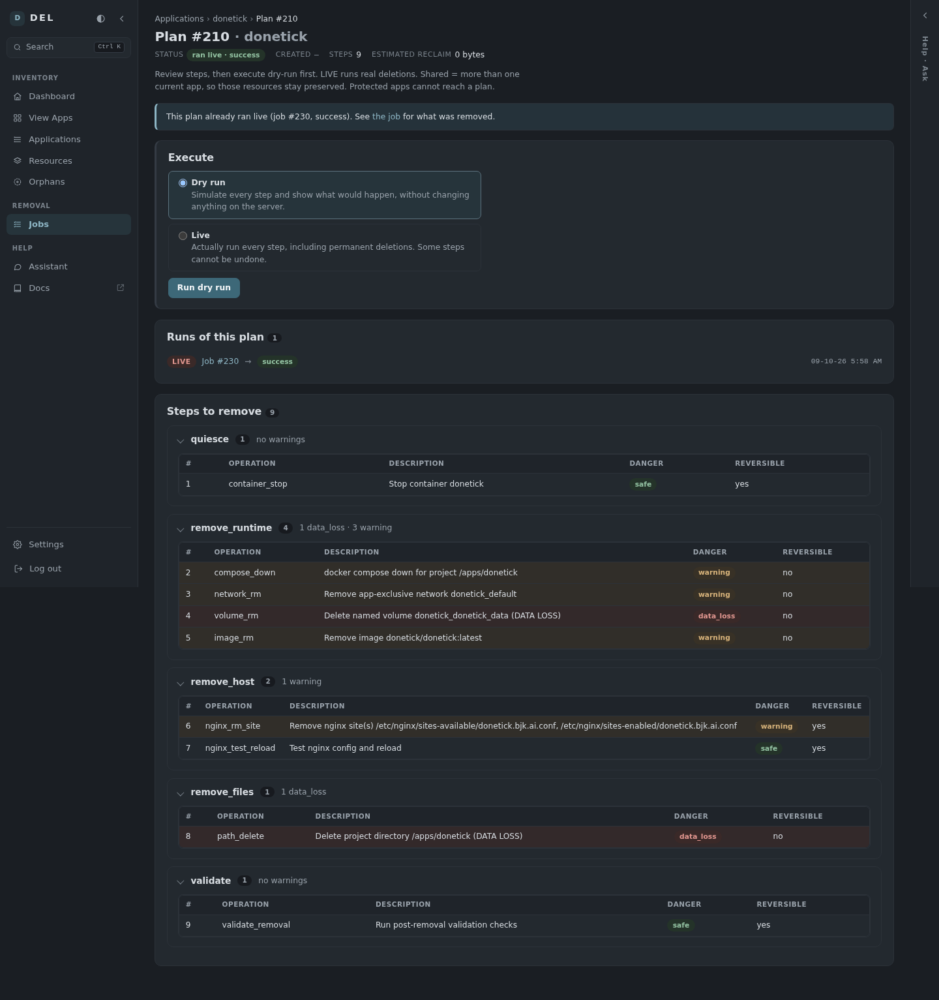
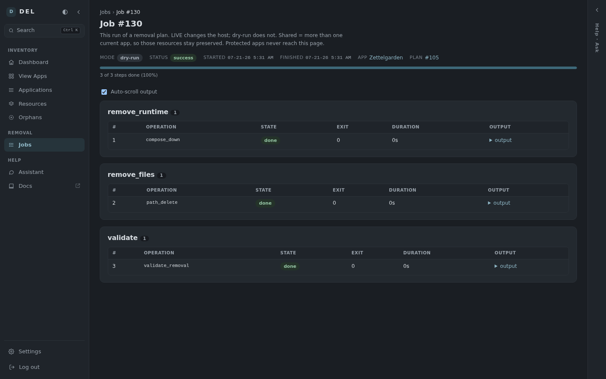

This page (`/docs/guides/sop`) is the source of truth for the operator loop. The dashboard repeats it inside **How to use DEL** — a `
` panel that is **open by default**. Do not skip Ask on shared or weak rows. Do not delete from Orphans. Dry-run before LIVE.

Legend chips on the dashboard (same meanings as Vocabulary below):

- **shared** = 2+ current apps
- **probable** = strong owner
- **possible** = weak
- **no probable owner → Orphans** (unassigned chips = no association rows, stricter)
- **Ask** = read-only

Chrome: primary `.btn` is `min-height: 2.35rem`; `.panel` radius is 12px (`--radius`). Compact `.btn-sm` in the How-to action group is still ~2rem.

<Callout intent="warning">
  **Remove app now (skips review)** is not this loop. It runs a complete-removal plan live with one confirm. Use **Plan removal** unless you already know the blast radius.
</Callout>

<Steps>
  <Step title="Scan">
    Dashboard: one primary **Run scan now**. Wait until the strip is `done`.
    Scanning is on demand — DEL does not scan continuously.
    <Frame caption="Dashboard after a completed scan (stat cards, recent scans, jobs).">
      
    </Frame>
  </Step>
  <Step title="Applications">
    Open [Applications](https://del.bjk.ai/apps). Filter warnings and protected. Open an app for confidence and evidence. Protected apps have no plan.
    <Frame caption="Application list from the latest scan.">
      
    </Frame>
  </Step>
  <Step title="Resources">
    [Resources → Containers](https://del.bjk.ai/resources/container), then the other tabs. Owner chips are current apps. **Shared** = more than one current app — do not delete with a single app. `unassigned` chips mean no association rows; Orphans is no probable owner.
    <Frame caption="Volumes with owners — the same ownership model as Ask.">
      
    </Frame>
  </Step>
  <Step title="Orphans">
    [Orphans](https://del.bjk.ai/orphans) is **review-only**. There is no delete on that page. Read Why listed. Ask the row if it might belong to an app DEL missed.
    <Frame caption="Actionable orphan candidates.">
      
    </Frame>
  </Step>
  <Step title="Ask">
    Right-rail **Ask** (mobile: Ask). Page-aware prompts. Row **Ask** chips stay in the rail. Ask is read-only and quotes owners from inventory context (`all_owners` / `also_owners`). It cannot plan or remove.
  </Step>
  <Step title="Plan, then Jobs">
    App page → **Plan removal**. Backup if `data_loss_risk` is data. Build → dry-run → LIVE (`y` if volumes). Track on [Jobs](https://del.bjk.ai/jobs).
    <Frame caption="Plan preview before execute.">
      
    </Frame>
    <Frame caption="Dry-run job — host unchanged.">
      
    </Frame>
  </Step>
</Steps>

## Vocabulary (one meaning)

<AccordionGroup>
  <Accordion title="Shared">
    More than one **current** app owns the resource. Removal of one app keeps it. Ask must name every owner.
  </Accordion>
  <Accordion title="Probable vs possible (confidence)">
    Numeric score: probable ≥ 60 is a **strong owner claim** (counts on Orphans). Possible ≥ 30 is **weak** — review, do not treat as an owner. Unrelated below that.
  </Accordion>
  <Accordion title="Ownership = possible">
    A different field from the confidence band. Weak **ownership enum**, not “possible confidence.”
  </Accordion>
  <Accordion title="Unassigned vs Orphans">
    **unassigned** chip = no association rows. **Orphans** page = no probable (≥60) current owner (possible/weak claims may still exist). Not “Docker volume unused” and not “safe to delete here.”
  </Accordion>
  <Accordion title="Protected">
    App flag. DEL will not build a removal plan (example: DEL itself).
  </Accordion>
</AccordionGroup>

## Mobile

On a phone: hamburger nav in these docs; in the app, Help and Ask FABs. Tables scroll sideways. Prefer Ask chips over typing on small screens.

## Next

<CardGroup cols={2}>
  <Card title="Removing an Application" href="/guides/removing-an-application">
    Screenshot walkthrough of plan vs skip-review.
  </Card>
  <Card title="Assistant" href="/guides/assistant">
    What Ask is allowed to see.
  </Card>
  <Card title="Architecture" href="/reference/architecture">
    Privilege split and scan pipeline.
  </Card>
  <Card title="Confidence" href="/guides/confidence">
    Why probable is never auto-removed.
  </Card>
</CardGroup>
