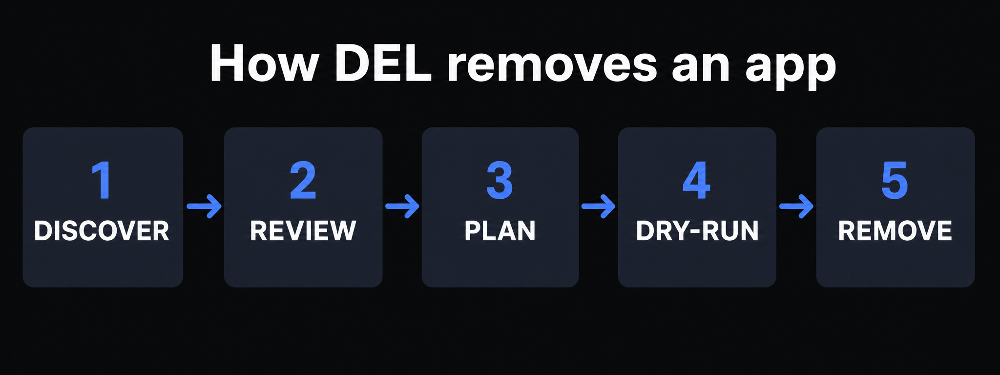
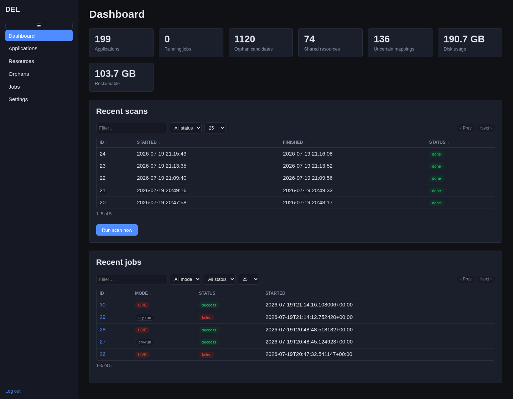

**DEL** is a self-hosted admin tool for **discovering, reviewing, and safely
uninstalling** the applications running on this server. It continuously scans
Docker/Compose, Nginx, systemd, cron, running processes, and the filesystem, then
correlates everything it finds into *applications* — each with a confidence score and
the full list of resources it owns (containers, images, volumes, networks, nginx
sites, units, timers, cron jobs, directories, and more).

When you want an application gone, DEL builds a **staged, backed-up, dry-run-first
removal plan** and executes it through a separate privileged helper. Every deletion
is previewed before it runs, backed up before it happens, and validated after. The
one truly irreversible step — deleting a named volume — is gated behind a typed
confirmation phrase. DEL is careful by construction: it cannot remove itself, it
refuses shared resources unless you approve them, and anything it is unsure about is
blocked rather than deleted.

<Frame caption="Every removal follows the same path: discover the app, review what it owns, build a plan, dry-run it, then remove.">
  
</Frame>

<Frame caption="The DEL dashboard: clickable stat cards, recent scans, and recent jobs.">
  
</Frame>

## Where to next

<CardGroup cols={2}>
  <Card title="Logging In" href="/guides/logging-in">
    Sign in and find your way around the interface.
  </Card>
  <Card title="Scanning Your Server" href="/guides/scanning">
    Run the read-only scan that builds your application inventory.
  </Card>
  <Card title="Removing an Application" href="/guides/removing-an-application">
    The full, screenshot-by-screenshot walkthrough of a safe uninstall.
  </Card>
  <Card title="Understanding Confidence" href="/guides/confidence">
    What the confidence badges mean and what is eligible for removal.
  </Card>
  <Card title="Backups & Restore" href="/guides/backups">
    Where backups land and how to roll a removal back.
  </Card>
  <Card title="Architecture" href="/reference/architecture">
    How DEL is built: the privilege split, the scan pipeline, the job engine.
  </Card>
  <Card title="Deployment Convention" href="/reference/deployment-convention">
    The house standard for deploying (and decommissioning) any app on this
    server — Docker or non-Docker.
  </Card>
</CardGroup>

## Quick facts

| Item | Value |
|---|---|
| URL | https://del.bjk.ai |
| Bind | 127.0.0.1:8075 (Nginx-fronted only, not publicly reachable directly) |
| Web unit | `del-web.service` — runs as user `bjkai` (groups `bjkai`, `docker`, `adm`) |
| Helper unit | `del-helper.service` — runs as `root`, strictly allowlisted |
| Docs unit | `del-docs.service` — this documentation site, basic-auth protected via Nginx |
| Database | SQLite, WAL mode, `/apps/del/database/del.db` |
| Manifests | `/apps/del/manifests/*.yaml` |
| Backups | `/apps/del/backups/` |
| Admin CLI | `/apps/del/scripts/del-admin` (`create-admin`, `change-password`, `migrate`, `rescan`, `backup-db`) |
| Protection | DEL is flagged `protected` — the planner refuses to build a removal plan for it |

DEL is read-only against the host in everything except an operator-approved,
executed removal job. Scanning, browsing, and plan-building never change anything on
the server.
