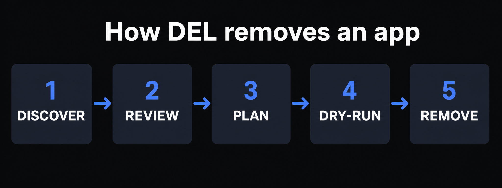
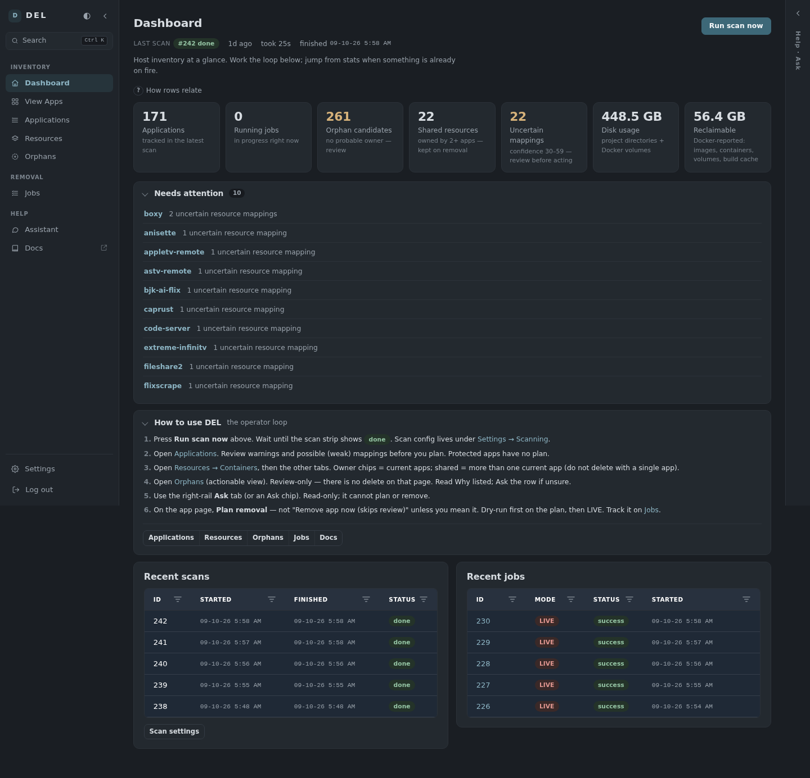

**DEL** is a self-hosted admin tool for **discovering, reviewing, and safely
uninstalling** the applications running on this server. It inventories on demand (Run scan now)
Docker/Compose, Nginx, systemd, cron, running processes, and the filesystem, then
correlates everything it finds into *applications* — each with a confidence score and
the full list of resources it owns (containers, images, volumes, networks, nginx
sites, units, timers, cron jobs, directories, and more).

The live dashboard opens **How to use DEL** in a `
` block (`open` by
default). The chip row above it is the vocabulary: **shared**, **probable**,
**possible**, **unassigned**, **Ask = read-only**. Primary buttons are about
`min-height: 2.35rem`; panels use a slightly rounder 12px radius. The loop
itself is documented once at [Operator loop](/guides/sop) (`/docs/guides/sop`)
— that page is the source of truth; the dashboard is the same list in the UI.

When you want an application gone, DEL builds a **staged removal plan** and
executes it through a separate privileged helper. The step-by-step plan
builder previews every deletion before it runs, is dry-run first by default,
and can optionally back the app up before deleting anything (choose a backup
mode — the default is *None*). Deleting a named volume through that flow is
additionally gated behind a typed confirmation phrase. A one-click
**Remove app now** button skips the preview, the dry-run, and that typed
phrase, and instead runs a complete-removal plan live immediately behind a
single confirm dialog. Either way, every deletion is validated after the
fact, and DEL is careful by construction: it cannot remove itself, it refuses
shared resources unless you approve them, and anything it is unsure about is
preserved rather than deleted. See
[Removing an Application](/guides/removing-an-application) for both paths.

<Frame caption="The step-by-step removal path: discover the app, review what it owns, build a plan, dry-run it, then remove.">
  
</Frame>

<Frame caption="The DEL dashboard: clickable stat cards, recent scans, and recent jobs.">
  
</Frame>

<Tabs>
  <Tab title="Operator">
    Work the [operator loop](/guides/sop) (source of truth). Dashboard **How to use DEL** is the same loop, open by default. Dry-run before LIVE.
  </Tab>
  <Tab title="Ask">
    Read-only. Quotes every current owner from inventory context. Cannot plan or delete. Page-aware prompts live in the right rail.
  </Tab>
  <Tab title="Admin">
    Units `del-web`, `del-helper`, `del-docs`. Helper is root on a unix socket with 22 allowlisted ops. See [Architecture](/reference/architecture).
  </Tab>
</Tabs>

## Where to next

<CardGroup cols={2}>
  <Card title="Operator loop" href="/guides/sop">
    SOP with screenshots, diagrams, and the vocabulary outline.
  </Card>
  <Card title="Logging In" href="/guides/logging-in">
    Sign in and find your way around the interface.
  </Card>
  <Card title="Scanning Your Server" href="/guides/scanning">
    Run the read-only scan that builds your application inventory.
  </Card>
  <Card title="Removing an Application" href="/guides/removing-an-application">
    The full, screenshot-by-screenshot walkthrough of a safe uninstall.
  </Card>
  <Card title="Understanding Confidence" href="/guides/confidence">
    What the confidence badges mean and what is eligible for removal.
  </Card>
  <Card title="Backups & Restore" href="/guides/backups">
    Where backups land and how to roll a removal back.
  </Card>
  <Card title="Architecture" href="/reference/architecture">
    How DEL is built: the privilege split, the scan pipeline, the job engine.
  </Card>
  <Card title="Deployment Convention" href="/reference/deployment-convention">
    The house standard for deploying (and decommissioning) any app on this
    server — Docker or non-Docker.
  </Card>
</CardGroup>

## Quick facts

| Item | Value |
|---|---|
| URL | https://del.bjk.ai |
| Bind | 127.0.0.1:8075 (Nginx-fronted only, not publicly reachable directly) |
| Web unit | `del-web.service` — runs as user `bjkai` (groups `bjkai`, `docker`, `adm`) |
| Helper unit | `del-helper.service` — runs as `root`, strictly allowlisted (22 operations), executing a root-owned copy at `/usr/local/lib/del-helper/` |
| Docs unit | `del-docs.service` — this documentation site (open; no basic auth). App UI still session-login. Not installed by `install.sh` |
| App launcher | `/view-apps` — an authenticated gallery of the apps this host currently serves, live-checked over HTTPS |
| Database | SQLite, WAL mode, `/apps/del/database/del.db` |
| Manifests | `/apps/del/manifests/*.yaml` |
| Backups | `/apps/del/backups/` |
| Admin CLI | `/apps/del/scripts/del-admin` (`create-admin`, `change-password`, `migrate`, `rescan`, `backup-db`) |
| Protection | DEL is flagged `protected` — the planner refuses to build a removal plan for it |
| Unauthenticated routes | `/login`, `/healthz`, `/favicon.ico`, and `/static/*` (`app.css`, `app.js`, `theme-init.js`, `favicon.svg`, `assistant.css`, `assistant.js`, vendored AG Grid). Everything else needs a session |

DEL is read-only against the host in everything except an operator-approved,
executed removal job. Scanning, browsing, and plan-building never change anything on
the server.
