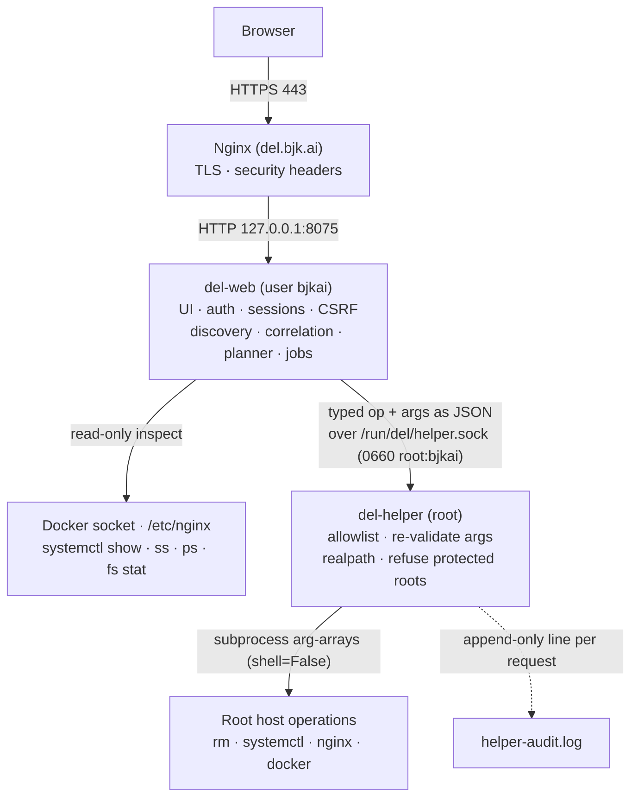
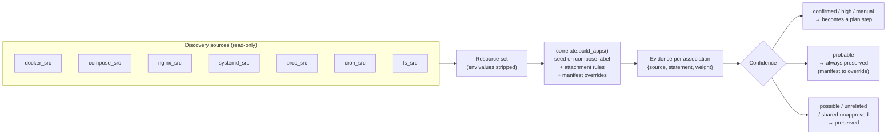
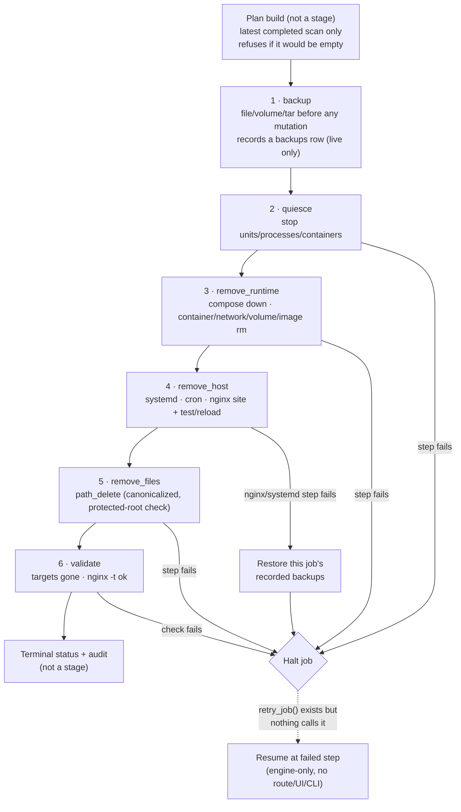

DEL is a self-hosted administrative application for discovering, reviewing, and
completely uninstalling applications from this server (bjkai-2tb-ubuntu). It is
served at https://del.bjk.ai behind Nginx, bound only to localhost.

## Stack

| Layer | Choice | Rationale |
|---|---|---|
| Language | Python 3.10 (system python3, venv) | Already on host; excellent for sysadmin tooling; typed with dataclasses/pydantic |
| Web framework | FastAPI + Uvicorn | Typed request/response models, async, small footprint |
| Templates/UI | Jinja2 server-rendered + vanilla JS + single CSS file | No Node toolchain; fully self-contained (CSP-friendly, no CDN); dark-mode via CSS |
| Database | SQLite (WAL mode) via sqlite3 + migration runner | Single admin user; zero-ops; file lives in /apps/del/database/del.db |
| Privileged layer | del-helper: separate root daemon on a unix socket | Strict allowlist; web app never runs shell as root |
| Deployment | Host systemd units (del-web.service, del-helper.service, del-docs.service) | See below |

### Why systemd, not a container

DEL's job is to inspect and modify *host* state: systemd units, nginx configs,
cron files, arbitrary project directories, tmux sessions, and the Docker daemon.
A containerized DEL would need: the Docker socket, /etc, /apps, /data, /run/systemd,
host PID namespace, and root — i.e. a fully privileged container that is strictly
harder to reason about than small host services. The spec permits Compose
"where appropriate"; here it is not. DEL is instead deployed as systemd units
with pinned dependencies in a dedicated venv, which gives restart policies, health
via systemd, and journald logging.

### Deployment units

- **del-web.service** — the FastAPI app (this document's main subject), port 8075,
  bound to 127.0.0.1, fronted by Nginx at https://del.bjk.ai.
- **del-helper.service** — the privileged root daemon on the unix socket. It
  executes `/usr/local/lib/del-helper/del_helper.py` with the policy at
  `/etc/del/helper-policy.json` — root-owned deployed copies installed by
  `scripts/install.sh`, *not* the repo working tree. `/apps/del` is writable by the
  `bjkai` user that runs `del-web`, so running the helper from there would let a
  compromised web tier rewrite the code root executes and the allowlist bounding
  it. Redeploy after editing `helper/` or `config/helper-policy.json`, before
  restarting the unit.
- **del-docs.service** — serves this documentation site (Fern, `fern/` sources) on
  127.0.0.1:8072/8073, fronted by Nginx at `/docs` (and its `/_next` static assets)
  **without** HTTP basic auth (open docs). The app UI at `/` still requires DEL
  session login. Docs carry no privileged access — static/rendered content only.
  `install.sh` does not install this unit; see [Installation](/installation).

## Process / privilege model



The privileged boundary is the unix socket: `del-web` can only *ask* for a typed
operation, and `del-helper` independently re-validates every argument before it acts.

```
Browser
  ↓ HTTPS (443)
Nginx (del.bjk.ai) — TLS, security headers
  ↓ HTTP 127.0.0.1:<PORT>
del-web (user bjkai, groups docker+adm)
  • UI, auth, sessions, CSRF
  • Discovery engine (read-only: docker socket, /etc/nginx, systemctl show, ss, ps, filesystem stat)
  • Correlation engine + confidence scoring
  • Manifests, removal planner (dry-run), job orchestration, audit log
  ↓ JSON over unix socket /run/del/helper.sock (0660 root:bjkai)
del-helper (root, Python stdlib only, ~1,100 lines across del_helper.py +
            validation.py, no web framework; runs from /usr/local/lib/del-helper/)
  • Fixed 22-operation allowlist (see below)
  • Validates every argument; canonicalizes paths (realpath, no symlink escape)
  • Refuses protected roots; refuses paths outside approved roots
  • Refuses protected units (del-*, sshd, nginx, docker, systemd-*, cron, …)
  • Every request logged to /apps/del/logs/helper-audit.log (append-only), with
    plan_id/step_id/job_id/requested_by when the caller supplies them
  • dry_run flag honored on every operation
```

del-web never constructs shell strings from user input. Every privileged action is
a typed operation name + validated structured arguments. del-helper executes via
subprocess arg-arrays (never shell=True).

The helper reads `op`, `args` and `dry_run` and nothing else that affects its
decisions. It has **no concept of a plan**: plan integrity is a web-side control
(`planner.verify_plan`, an HMAC over the canonical steps JSON, checked before job
creation and again before execution). What bounds a compromised `del-web` is the op
allowlist plus the helper's independent argument validation — read every "must
appear in the approved plan" note in the table below as a planner-side constraint.

### Helper operation allowlist (complete)

| Operation | Args | Notes |
|---|---|---|
| ping | — | health |
| list_listeners | — | read-only `ss -lntp` as root; used by `proc_src.py` to resolve listener ownership when the caller can't run `ss` itself |
| compose_down | project, config_files[], remove_volumes?, remove_images_mode? | config files must exist & be under approved roots |
| container_stop / container_rm | container_id | id validated against docker inspect |
| image_rm | image_id | refused if other containers reference it |
| volume_rm | volume_name | refused unless plan approved w/ double confirmation flag |
| network_rm | network_name | refuses bridge/host/none and networks with foreign containers |
| systemd_stop / systemd_disable / systemd_rm_unit | unit | name must match `^[A-Za-z0-9@_.-]+\.(service\|timer)$` and must not match `protected_units`; rm restricted to /etc/systemd/system + daemon-reload |
| cron_rm | path | **/etc/cron.d files only.** Takes one `path`, validated under the policy's `cron_d_dir`. It cannot edit a user crontab — there is no `crontab -l` diff and no way to remove a user-crontab line through DEL |
| nginx_rm_site | paths[] | only under /etc/nginx/sites-{enabled,available}; backup first; nginx -t; reload only on pass; restore on fail |
| nginx_test | — | read-only `nginx -t`, never reloads; safe in dry_run and live |
| nginx_test_reload | — | nginx -t, reload if ok |
| path_delete | path | canonicalized; must resolve at least one component deep under an approved root (/apps, /data, /srv, /var/www, /home/bjkai, /etc/nginx/sites-{available,enabled}, /etc/systemd/system, /etc/cron.d), must not be a protected root or on `never_delete`; refuses mountpoints |
| path_restore | backup_path, original_path | `cp -a` of a prior backup back to original_path. backup_path must exist under /apps/del/backups; original_path must resolve under a DEL-managed root, not protected/never-delete, and **must have the same basename as the backup** — a restore may only replace the file it was taken from. A protected unit cannot be recreated in /etc/systemd/system this way |
| tmux_kill | session | exact session name |
| process_term | pid, expected_exe | TERM then KILL after grace; pid+exe must still match, re-verified before the SIGKILL |
| backup_tar | src_path, dest | src_path confined to DEL-managed roots (so root cannot be made to archive /etc/shadow or a TLS key); dest under /apps/del/backups only |
| volume_backup | volume, dest | docker run --rm -v vol:/src:ro tar → /apps/del/backups. A tar of *contents*, so `path_restore` cannot put it back |
| file_backup | path, dest | timestamped copy before config edits; path confined to DEL-managed roots, dest under /apps/del/backups |

"DEL-managed roots" = the approved deletion roots plus the three system config
directories DEL is allowed to remove files from and therefore must be able to back
up and restore: nginx sites, `/etc/systemd/system`, `/etc/cron.d`.

Protected roots (never deletable, even if listed): /, /bin, /boot, /dev, /etc,
/home, /lib, /lib64, /opt, /proc, /root, /run, /sbin, /srv, /sys, /tmp, /usr,
/var, /apps, /data, and /apps/del itself (DEL is a protected application).

Protected units (never stopped, disabled or removed): `del-*.service`,
`del-*.timer`, `ssh`/`sshd`, `nginx`, `docker`/`containerd`, `systemd-*`, `cron`,
`dbus`, `network*`, `polkit`, `rsyslog`, `fail2ban`, `ufw` — the full glob list is
`protected_units` in `helper-policy.json`. DEL's own units come first deliberately:
stopping `del-helper` is the opening move in a helper-code-swap attack.

Approval flow: `del-web` builds a plan, signs it with an HMAC over the canonical
steps JSON, and stores it. `planner.verify_plan()` re-checks that signature before
a job is created and again before it executes — **web-side**. The helper is sent
`op`/`args`/`dry_run` (plus correlation ids it only logs) and re-validates every
argument against its own policy independently. Neither layer depends on the other
being uncompromised.

## Components (code layout)

```
/apps/del/
├── backend/del_app/
│   ├── main.py            FastAPI app factory, routes mounting
│   ├── config.py          settings (port, paths) from /apps/del/config/del.toml
│   ├── db.py              sqlite connection, migration runner
│   ├── migrations/        001_init.sql (schema), 002_indexes.sql (secondary indexes)
│   ├── auth.py            login, argon2id hashing, sessions, CSRF, rate limit
│   ├── models.py          typed dataclasses / pydantic models
│   ├── discovery/
│   │   ├── docker_src.py  containers/images/volumes/networks via docker socket
│   │   ├── compose_src.py compose file scanner + parser
│   │   ├── nginx_src.py   site config parser
│   │   ├── systemd_src.py units/timers via systemctl show
│   │   ├── proc_src.py    ss/ps/tmux/screen
│   │   ├── cron_src.py    crontabs/cron.d
│   │   └── fs_src.py      project dirs, git repos, du
│   ├── correlate.py       evidence-based association + confidence scoring
│   ├── manifests.py       YAML manifests read/write/validate
│   ├── planner.py         removal plan generation (dry-run), impact/risk report, HMAC
│   ├── jobs.py            staged job engine (backup→quiesce→remove_runtime→remove_host→remove_files→validate), step records, backup recording, in-job restore
│   ├── helper_client.py   unix-socket client to del-helper
│   ├── auditlog.py        append-only audit records
│   └── web/               routes + Jinja2 templates + static/
├── helper/
│   ├── del_helper.py      root daemon (stdlib only) — source; deployed to /usr/local/lib/del-helper/
│   └── validation.py      pure argument/path validation, imported by the daemon
├── config/                del.toml, the three .service units, nginx site, helper-policy.json
├── database/del.db
├── manifests/*.yaml
├── backups/
├── logs/
├── docs/                  durable reference (architecture, discovery, removal lifecycle, …)
├── reports/<date>/        finished one-off audits and working notes
├── fern/                  the sources for this documentation site
├── scripts/
│   ├── install.sh         idempotent installer (helper deploy, units, nginx, health)
│   ├── del-admin          CLI: create-admin, change-password, migrate, rescan, backup-db
│   ├── gen-registry.py    writes docs/PORT-REGISTRY.md from the latest scan (read-only)
│   ├── gen-registry.sh    thin wrapper around gen-registry.py
│   └── make-demo-app.sh   builds a disposable demo app for exercising removal
└── tests/
```

## Data model (SQLite)

- users(id, username, password_hash, created_at, last_login)
- sessions(token_hash, user_id, created, expires, ip)
- scans(id, started, finished, status, stats_json)
- applications(id, slug, name, status, kind, protected, manifest_path, first_seen, last_seen)
- resources(id, type, key, display, path, state, data_json, first_seen scan, last_seen scan)
- associations(app_id, resource_id, confidence, ownership, shared, data_loss_risk,
  removal_eligible, recommended_action, evidence_json, source, approved_by_user, excluded)
- plans(id, app_id, created, options_json, steps_json, status, hmac)
- jobs(id, plan_id, mode dry_run|live, started, finished, status, user_id)
- job_steps(id, job_id, seq, stage, operation, args_json, state, exit_code, output_sanitized, started, finished, reversible)
- backups(id, job_id, kind, src, dest, sha256, size, created)
  — one row per completed backup step of a **live** job, written before any deletion
  runs; this is what the in-job restore path reads. **`sha256` and `size` are
  declared but never populated** — backups are plain copies, not content-addressed.
- audit_log(id, ts, user_id, action, subject, details_json)  — no secrets ever.
  Deliberately not indexed: nothing in the codebase reads it. It needs a retention
  policy, not an index.
- settings(key, value)

### Indexes (`002_indexes.sql`)

`001_init.sql` declared foreign keys but no indexes, and SQLite does not create them
for foreign keys — so every page load rebuilt AUTOMATIC COVERING INDEXes over
`associations` on the fly. Migration 002 adds 11 secondary indexes: four on
`associations` (`resource_id`; `(app_id, excluded)`; `removal_eligible`; a partial
index on `shared` where `shared = 1`), `resources(type, last_seen)`,
`applications(last_seen)`, `job_steps(job_id, seq)`, `jobs(plan_id, status)`,
`backups(job_id)`, `scans(status, id)` and `sessions(expires)`. Measured 2.4x across
the 14 hot queries on a copy of the production DB, for about 4% growth.

Two omissions are deliberate and were measured: no standalone `resources(last_seen)`
(it makes the query planner flip a join and the whole set regresses; the composite
covers it), and no `ANALYZE` (with `sqlite_stat1` present the dashboard's
"uncertain" query picks a skip-scan and degrades ~10x).

## The live app gallery (`/view-apps`)

`GET /view-apps` is an authenticated, read-only projection of the inventory. A domain
is eligible only when it belongs to an application and an **enabled** Nginx resource
from the latest completed scan; DEL then verifies each candidate over HTTPS and
shows responses below 500, hiding connection/TLS failures and 5xx.

Health results are cached in-process for five minutes and served
**stale-while-revalidate**: whatever is cached renders immediately and a stale batch
is re-probed on a background thread, coalesced so concurrent requests do not stack
up refreshes. Only two cases block on the network — an explicit `?refresh=1`, and a
domain with nothing cached at all (the first load after a restart, where blocking is
the difference between a populated gallery and an empty one).

The gallery writes nothing to SQLite — categories, stars, hidden cards,
size/density, view mode and drag order are browser-local.

**Icons are proxied, never loaded cross-origin.** Cards point `` at
`GET /app-icon/{domain}`, which is itself session-authenticated. That route
normalizes the hostname, requires it to be an enabled Nginx site in the latest scan
(so it cannot be used as a general-purpose outbound fetcher), fetches
`https://{domain}/favicon.ico` server-side with a 4s timeout, caps the body at
256 KiB, checks the content type, and caches results in-process — 24h for a hit, 1h
for a miss. Anything that is not a 200 image, including a `401` carrying
`WWW-Authenticate`, becomes an empty **204** and the card falls back to its initial
letter.

<Callout intent="info">
  The reason is concrete: pointing the `` straight at the third-party origin
  made the *browser* issue those requests, so every app behind HTTP basic auth
  answered `401 + WWW-Authenticate` and the browser opened a credential dialog on
  top of a page the operator was already authenticated to.
</Callout>

Two related route details: `GET /favicon.ico` is a 301 to `/static/favicon.svg`
(browsers request it unprompted; it used to 404 on every page load), and the four
`/static/*` assets now send `Cache-Control`, with the pinned 1.9 MB AG Grid bundle
marked `immutable`.

## Discovery pipeline

A scan fans out to independent, read-only source modules, folds their results into a
single resource set, correlates that set into applications, and scores each
association's confidence from its evidence.



See [Understanding Confidence](/guides/confidence) for the operator-facing view.

## Confidence scoring

Levels: confirmed (95–100), high (80–94), probable (60–79), possible (30–59),
unrelated (&lt;30), manual (`source = 'manual'`). Each association stores evidence
items {source, statement, weight}. Compose project label = confirmed. Nginx
proxy_pass port → published container port = high. For host-network containers (no
published port mapping to key off), `proc_src` traces a listening port's pid back to
its owning container by matching the socket inode in `/proc/<pid>/fd` — an exact
match with no uid-based fallback; unresolved is the correct answer when it fails. A
proxy_pass port matching that cgroup-resolved container's listener is high
confidence, with evidence naming the container and noting "(host network)". Docker
networks are
correlated by attached-container **name** (not container id, which changes on
recreation) so a network keeps its owner mapping across container restarts; a
network attached to containers from more than one app is `shared` and preserved
unless approved per-app. Nginx configs with no live upstream to match (the app's
containers are already stopped) are still attached to the correct app whenever
the config's `server_name` slugifies to *exactly* the app's slug — this exact-match
rule (deliberately not fuzzy) catches leftover config debris (`.conf`/`.bak`/
disabled copies) that port-matching alone would miss, and it **upgrades** a
weaker port-match claim the app may already hold on that same file rather than
skipping it, so an app's own stale `sites-available` copy is always
removal-eligible along with the rest of the app. Name similarity alone =
possible, never auto-removable.

**What actually becomes a plan step** (`planner._classify`): only `confirmed`,
`high` and `manual` associations, and only when they are not excluded, not
`removal_eligible = 'blocked'`, and not (shared and unapproved). Everything else is
recorded as a preserved resource plus a warning.

<Callout intent="warning">
  `probable` is **never** a step. `_classify` returns "requires per-resource
  approval" for every `probable` row unconditionally — it does not consult
  `approved_by_user`. Approving a `probable` association therefore does not make it
  removable; declare the resource in the app's manifest instead. `approved_by_user`
  is read in exactly two places: to unblock a `confirmed`/`high`/`manual`
  association flagged `shared`, and to approve an individual named volume for
  `volume_rm`.
</Callout>

Manifest entries are set to `level = "manual"` in memory by `correlate.py`, but the
scanner persists the literal string `"correlate"` into `associations.source` for
every row it writes, and both `_level()` implementations derive `manual` solely from
`source == 'manual'`. So a manifest association — confidence 100 — is displayed and
classified as **`confirmed`**, not `manual`. It is fully removal-eligible either
way; only the badge differs.

Applications aren't only Docker/Compose — a purely systemd-managed service (no
container at all) is seeded as its own first-class application (`kind
"systemd"`) whenever one of its custom (non-vendor) unit's
`WorkingDirectory`/`ExecStart` resolves to a directory directly under a scan
root, e.g. `/apps/xtr`. Discovery also captures custom unit *files* that are
currently disabled/inactive (not just ones `systemctl list-units` reports as
loaded), so a stopped non-Docker service (e.g. `htmls`, `ppv`) is still
discovered instead of being invisible.

## Removal job engine

Plans are immutable once approved (any edit to `steps_json` fails the HMAC check). A
job executes plan steps in stage order; each step is recorded before execution
(state=running) and after (done/failed). Any failure halts the job before downstream
deletions. Steps carry reversible=true/false.

**`planner.STAGE_ORDER` is exactly six values** — `backup`, `quiesce`,
`remove_runtime`, `remove_host`, `remove_files`, `validate` — and those are the only
strings that ever appear in `job_steps.stage`. Analysis and preview happen at
plan-build time, and the report is the job's terminal status plus its audit records;
none of the three produce step rows.

**Plan build refuses on an empty result.** `build_plan` scopes an app's associations
to the latest scan with `status = 'done'`. If the app has associations but none in
that scan, it raises `PlanError` telling the operator to re-scan, rather than
emitting an empty plan that would execute "successfully" having removed nothing —
which is exactly what used to happen when a plan was built while a scan was running.

**Rollback.** Live backup steps write a `backups` row before any deletion. If an
`nginx_rm_site`, `nginx_test_reload`, `systemd_disable` or `systemd_rm_unit` step
fails, the engine restores this job's recorded backups newest-first via the helper's
`path_restore` and audits the real per-backup outcome. Volume archives are skipped
and reported as manual-restore. Independently of all this, `nginx_rm_site` restores
its own files inside the helper if `nginx -t` fails after removal; that path never
depended on the `backups` table and has always worked.

<Callout intent="warning">
  **Resume exists in the engine but is not exposed.** `jobs.retry_job()` resets the
  first failed step and everything after it and re-executes. Nothing calls it —
  there is no `/jobs/{id}/retry` route, no UI button and no CLI subcommand.
  Recovering a failed job today means fixing the cause and either invoking
  `retry_job` from a Python shell or building a fresh plan.
</Callout>

Live volume deletion requires: plan option enabled + per-volume checkbox (or a
per-association approval) + typed confirmation phrase at execution time. After a
successful live job the engine runs a rescan; a rescan failure is audited as
`post_removal_rescan_failed` rather than leaving a stale inventory silently behind.

### The removal lifecycle



The volume-deletion gate sits on the `volume_rm` step in `remove_runtime`: it runs
live only with the plan option, the per-volume checkbox, and the typed `y` phrase all
present. See [Removing an Application](/guides/removing-an-application) for the
operator-facing walkthrough.

## Security summary

- Bind 127.0.0.1 only; Nginx terminates TLS with the bjk.ai wildcard cert.
- Session cookies: HttpOnly, Secure, SameSite=Lax; server-side session store; 12h
  expiry; expired rows swept at login.
- CSRF token on every mutating form/request; login rate limiting — a plain
  5-per-60s in-memory sliding window per IP, no backoff.
- Argon2id password hashing (`argon2.PasswordHasher`, the only hasher — no bcrypt
  fallback); admin account created via CLI, no defaults.
- CSP is sent by Nginx: `default-src 'self'` with `style-src` also allowing
  `'unsafe-inline'` (remaining inline `style=""` attributes) and `img-src` also
  allowing `data:`. HSTS carries `includeSubDomains`. No external asset origins.
- Secrets never logged; env values stripped at the discovery source layer; the DB
  and backups directory are not world-readable.
- Helper socket 0660 root:bjkai; 22 allowlisted operations; args validated twice;
  helper code and policy deployed root-owned outside `/apps/del`.
- Unauthenticated routes are exactly `/login`, `/healthz`, `/favicon.ico` and the
  four `/static/*` assets.
- DEL itself flagged protected=1; planner refuses to plan its removal.

See [Security Model](/reference/security) for the full detail.
